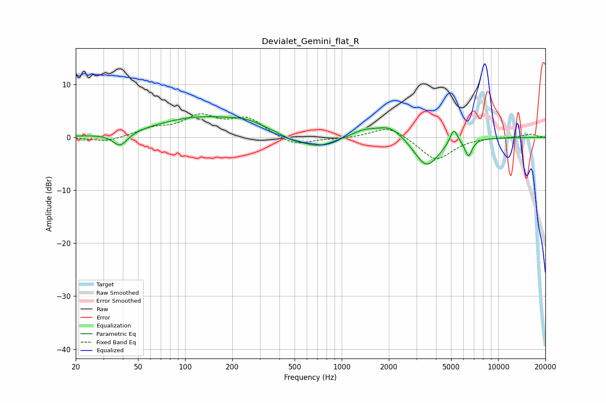

# Devialet_Gemini_flat_R
See [usage instructions](https://github.com/jaakkopasanen/AutoEq#usage) for more options and info.

### Parametric EQs
Apply preamp of -4.0 dB when using parametric equalizer.

|   # | Type    |   Fc (Hz) |    Q |   Gain (dB) |
|-----|---------|-----------|------|-------------|
|   1 | Peaking |        38 | 2.97 |        -2.6 |
|   2 | Peaking |       125 | 0.49 |         3.7 |
|   3 | Peaking |       248 | 1.39 |         1.2 |
|   4 | Peaking |       483 | 2.11 |        -0.8 |
|   5 | Peaking |       705 | 1.4  |        -2   |
|   6 | Peaking |      1380 | 1.98 |         1.1 |
|   7 | Peaking |      2034 | 1.58 |         2.5 |
|   8 | Peaking |      3481 | 1.77 |        -5.7 |
|   9 | Peaking |      5194 | 5.82 |         3   |
|  10 | Peaking |      6453 | 6    |        -3.1 |

### Fixed Band EQs
When using fixed band (also called graphic) equalizer, apply preamp of **-4.5 dB** (if available) and set gains manually with these parameters.

|   # | Type    |   Fc (Hz) |    Q |   Gain (dB) |
|-----|---------|-----------|------|-------------|
|   1 | Peaking |        31 | 1.41 |        -0.9 |
|   2 | Peaking |        62 | 1.41 |         1.5 |
|   3 | Peaking |       125 | 1.41 |         3.6 |
|   4 | Peaking |       250 | 1.41 |         3.3 |
|   5 | Peaking |       500 | 1.41 |        -1.7 |
|   6 | Peaking |      1000 | 1.41 |        -0.2 |
|   7 | Peaking |      2000 | 1.41 |         2.3 |
|   8 | Peaking |      4000 | 1.41 |        -4.4 |
|   9 | Peaking |      8000 | 1.41 |         0.1 |
|  10 | Peaking |     16000 | 1.41 |         0.6 |

### Graphs

