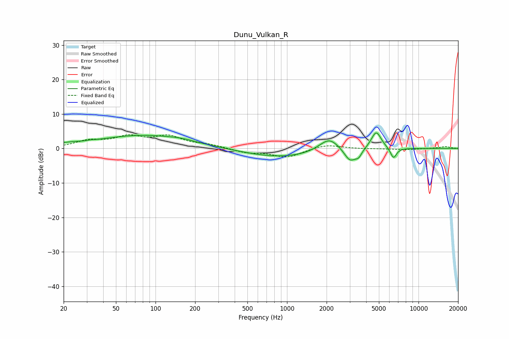

# Dunu_Vulkan_R
See [usage instructions](https://github.com/jaakkopasanen/AutoEq#usage) for more options and info.

### Parametric EQs
Apply preamp of -4.6 dB when using parametric equalizer.

|   # | Type    |   Fc (Hz) |    Q |   Gain (dB) |
|-----|---------|-----------|------|-------------|
|   1 | Peaking |        21 | 1.64 |         0.6 |
|   2 | Peaking |        32 | 5.99 |         0.1 |
|   3 | Peaking |        81 | 0.4  |         3.8 |
|   4 | Peaking |       155 | 1.58 |         0.4 |
|   5 | Peaking |       894 | 0.51 |        -2.6 |
|   6 | Peaking |      2094 | 1.84 |         4   |
|   7 | Peaking |      3017 | 3.1  |        -3.9 |
|   8 | Peaking |      3509 | 5.86 |        -1.7 |
|   9 | Peaking |      4768 | 3.59 |         5.2 |
|  10 | Peaking |      6453 | 5.83 |        -3.1 |

### Fixed Band EQs
When using fixed band (also called graphic) equalizer, apply preamp of **-4.1 dB** (if available) and set gains manually with these parameters.

|   # | Type    |   Fc (Hz) |    Q |   Gain (dB) |
|-----|---------|-----------|------|-------------|
|   1 | Peaking |        31 | 1.41 |         2   |
|   2 | Peaking |        62 | 1.41 |         3   |
|   3 | Peaking |       125 | 1.41 |         3.2 |
|   4 | Peaking |       250 | 1.41 |         0.9 |
|   5 | Peaking |       500 | 1.41 |        -1.2 |
|   6 | Peaking |      1000 | 1.41 |        -2.5 |
|   7 | Peaking |      2000 | 1.41 |         1.2 |
|   8 | Peaking |      4000 | 1.41 |        -0.1 |
|   9 | Peaking |      8000 | 1.41 |        -0.4 |
|  10 | Peaking |     16000 | 1.41 |         0.5 |

### Graphs

