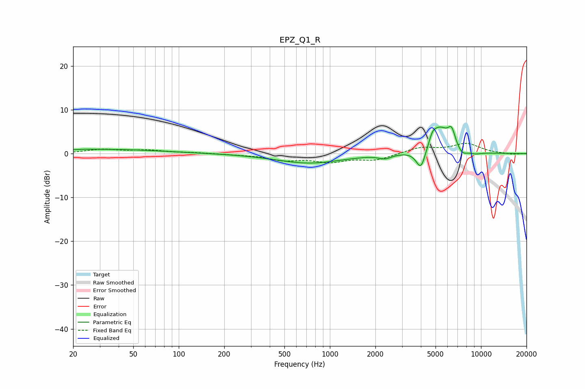

# EPZ_Q1_R
See [usage instructions](https://github.com/jaakkopasanen/AutoEq#usage) for more options and info.

### Parametric EQs
Apply preamp of -6.3 dB when using parametric equalizer.

|   # | Type    |   Fc (Hz) |    Q |   Gain (dB) |
|-----|---------|-----------|------|-------------|
|   1 | Peaking |        23 | 1.71 |         0.2 |
|   2 | Peaking |        36 | 0.4  |         0.9 |
|   3 | Peaking |       730 | 0.65 |        -2.2 |
|   4 | Peaking |      2321 | 3.36 |        -0.9 |
|   5 | Peaking |      4010 | 4.29 |        -5.1 |
|   6 | Peaking |      4773 | 6    |         1.6 |
|   7 | Peaking |      5309 | 2.02 |         6   |
|   8 | Peaking |      6390 | 5.69 |         3.3 |
|   9 | Peaking |      7496 | 4.02 |        -1.5 |
|  10 | Peaking |      9158 | 2.81 |        -0.5 |

### Fixed Band EQs
When using fixed band (also called graphic) equalizer, apply preamp of **-2.4 dB** (if available) and set gains manually with these parameters.

|   # | Type    |   Fc (Hz) |    Q |   Gain (dB) |
|-----|---------|-----------|------|-------------|
|   1 | Peaking |        31 | 1.41 |         0.9 |
|   2 | Peaking |        62 | 1.41 |         0.7 |
|   3 | Peaking |       125 | 1.41 |         0.2 |
|   4 | Peaking |       250 | 1.41 |        -0.2 |
|   5 | Peaking |       500 | 1.41 |        -1.4 |
|   6 | Peaking |      1000 | 1.41 |        -1.7 |
|   7 | Peaking |      2000 | 1.41 |        -1.4 |
|   8 | Peaking |      4000 | 1.41 |         1.4 |
|   9 | Peaking |      8000 | 1.41 |         2.2 |
|  10 | Peaking |     16000 | 1.41 |        -0.2 |

### Graphs

