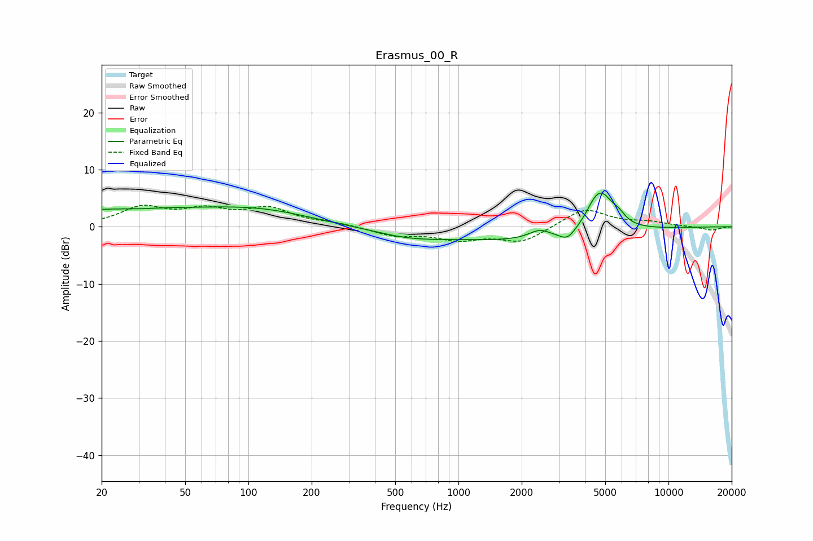

# Erasmus_00_R
See [usage instructions](https://github.com/jaakkopasanen/AutoEq#usage) for more options and info.

### Parametric EQs
Apply preamp of -6.0 dB when using parametric equalizer.

|   # | Type    |   Fc (Hz) |    Q |   Gain (dB) |
|-----|---------|-----------|------|-------------|
|   1 | Peaking |        26 | 0.24 |         3   |
|   2 | Peaking |        30 | 2.66 |        -0.1 |
|   3 | Peaking |       121 | 0.6  |         1.8 |
|   4 | Peaking |       584 | 0.81 |        -1.4 |
|   5 | Peaking |      2105 | 0.38 |        -2.4 |
|   6 | Peaking |      2429 | 2.8  |         1.5 |
|   7 | Peaking |      3300 | 3.78 |        -1.6 |
|   8 | Peaking |      4365 | 3.75 |         1.1 |
|   9 | Peaking |      4784 | 2.39 |         6.6 |
|  10 | Peaking |      5795 | 4.29 |         1.2 |

### Fixed Band EQs
When using fixed band (also called graphic) equalizer, apply preamp of **-3.9 dB** (if available) and set gains manually with these parameters.

|   # | Type    |   Fc (Hz) |    Q |   Gain (dB) |
|-----|---------|-----------|------|-------------|
|   1 | Peaking |        31 | 1.41 |         3.2 |
|   2 | Peaking |        62 | 1.41 |         2.5 |
|   3 | Peaking |       125 | 1.41 |         2.9 |
|   4 | Peaking |       250 | 1.41 |         0.5 |
|   5 | Peaking |       500 | 1.41 |        -1.5 |
|   6 | Peaking |      1000 | 1.41 |        -2   |
|   7 | Peaking |      2000 | 1.41 |        -2.7 |
|   8 | Peaking |      4000 | 1.41 |         3.3 |
|   9 | Peaking |      8000 | 1.41 |         0.7 |
|  10 | Peaking |     16000 | 1.41 |        -0.6 |

### Graphs

