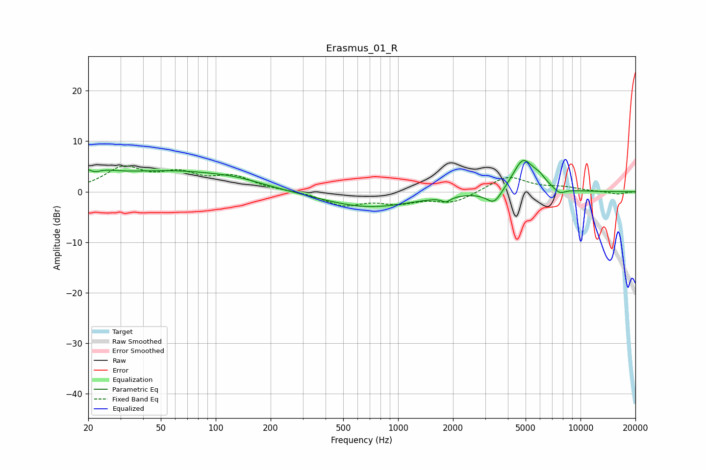

# Erasmus_01_R
See [usage instructions](https://github.com/jaakkopasanen/AutoEq#usage) for more options and info.

### Parametric EQs
Apply preamp of -6.3 dB when using parametric equalizer.

|   # | Type    |   Fc (Hz) |    Q |   Gain (dB) |
|-----|---------|-----------|------|-------------|
|   1 | Peaking |        20 | 1.54 |         4   |
|   2 | Peaking |        21 | 3.48 |        -1.8 |
|   3 | Peaking |        58 | 0.4  |         3.9 |
|   4 | Peaking |       132 | 1.04 |         0.7 |
|   5 | Peaking |       687 | 0.57 |        -3.1 |
|   6 | Peaking |      1832 | 6    |        -0.9 |
|   7 | Peaking |      3365 | 3.2  |        -2.9 |
|   8 | Peaking |      4841 | 2.38 |         6.4 |
|   9 | Peaking |      5954 | 3.7  |         1.5 |
|  10 | Peaking |      7698 | 4.3  |        -1.1 |

### Fixed Band EQs
When using fixed band (also called graphic) equalizer, apply preamp of **-5.2 dB** (if available) and set gains manually with these parameters.

|   # | Type    |   Fc (Hz) |    Q |   Gain (dB) |
|-----|---------|-----------|------|-------------|
|   1 | Peaking |        31 | 1.41 |         4.5 |
|   2 | Peaking |        62 | 1.41 |         3.1 |
|   3 | Peaking |       125 | 1.41 |         2.7 |
|   4 | Peaking |       250 | 1.41 |         0.1 |
|   5 | Peaking |       500 | 1.41 |        -2.6 |
|   6 | Peaking |      1000 | 1.41 |        -1.9 |
|   7 | Peaking |      2000 | 1.41 |        -2.1 |
|   8 | Peaking |      4000 | 1.41 |         3.1 |
|   9 | Peaking |      8000 | 1.41 |         0.8 |
|  10 | Peaking |     16000 | 1.41 |        -0.5 |

### Graphs

