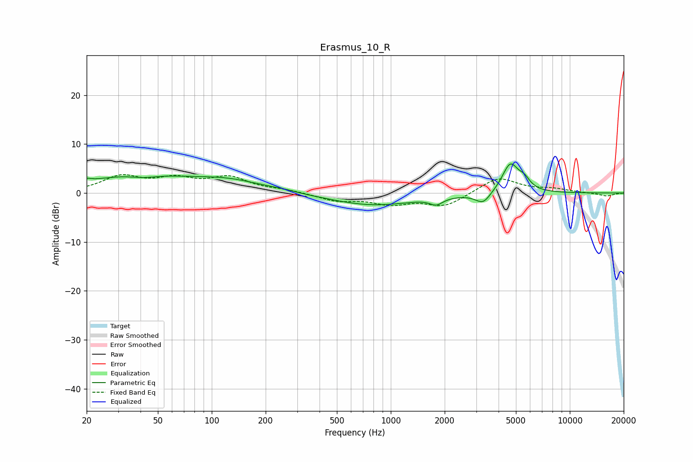

# Erasmus_10_R
See [usage instructions](https://github.com/jaakkopasanen/AutoEq#usage) for more options and info.

### Parametric EQs
Apply preamp of -6.0 dB when using parametric equalizer.

|   # | Type    |   Fc (Hz) |    Q |   Gain (dB) |
|-----|---------|-----------|------|-------------|
|   1 | Peaking |        20 | 5.98 |         0.6 |
|   2 | Peaking |        38 | 0.5  |         3.6 |
|   3 | Peaking |        42 | 1.78 |        -0.8 |
|   4 | Peaking |       126 | 0.73 |         2.1 |
|   5 | Peaking |       250 | 2.06 |         0.3 |
|   6 | Peaking |       796 | 0.59 |        -2.5 |
|   7 | Peaking |      1796 | 4.03 |        -1.3 |
|   8 | Peaking |      3283 | 3.33 |        -2.3 |
|   9 | Peaking |      4652 | 3.02 |         6   |
|  10 | Peaking |      5570 | 4.26 |         1.7 |

### Fixed Band EQs
When using fixed band (also called graphic) equalizer, apply preamp of **-3.9 dB** (if available) and set gains manually with these parameters.

|   # | Type    |   Fc (Hz) |    Q |   Gain (dB) |
|-----|---------|-----------|------|-------------|
|   1 | Peaking |        31 | 1.41 |         3.2 |
|   2 | Peaking |        62 | 1.41 |         2.5 |
|   3 | Peaking |       125 | 1.41 |         2.9 |
|   4 | Peaking |       250 | 1.41 |         0.5 |
|   5 | Peaking |       500 | 1.41 |        -1.5 |
|   6 | Peaking |      1000 | 1.41 |        -2   |
|   7 | Peaking |      2000 | 1.41 |        -2.7 |
|   8 | Peaking |      4000 | 1.41 |         3.3 |
|   9 | Peaking |      8000 | 1.41 |         0.7 |
|  10 | Peaking |     16000 | 1.41 |        -0.6 |

### Graphs

