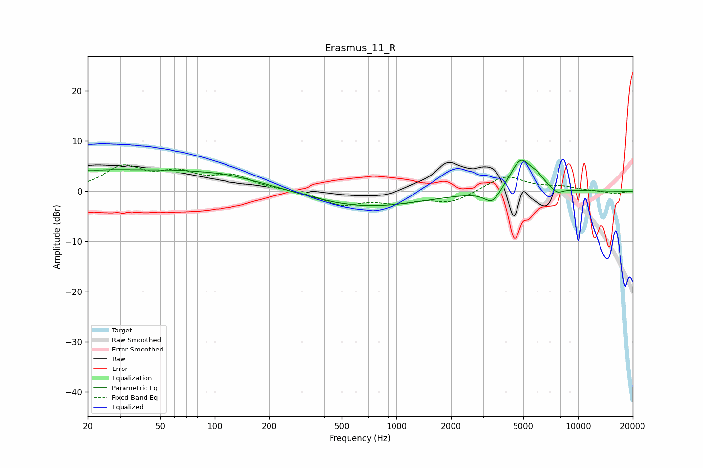

# Erasmus_11_R
See [usage instructions](https://github.com/jaakkopasanen/AutoEq#usage) for more options and info.

### Parametric EQs
Apply preamp of -6.3 dB when using parametric equalizer.

|   # | Type    |   Fc (Hz) |    Q |   Gain (dB) |
|-----|---------|-----------|------|-------------|
|   1 | Peaking |        20 | 5.4  |         0.6 |
|   2 | Peaking |        23 | 1.06 |         1.4 |
|   3 | Peaking |        61 | 5.99 |         0   |
|   4 | Peaking |        64 | 0.31 |         4.1 |
|   5 | Peaking |       113 | 2.48 |         0.2 |
|   6 | Peaking |       661 | 0.45 |        -3.2 |
|   7 | Peaking |      3376 | 3.21 |        -2.9 |
|   8 | Peaking |      4840 | 2.33 |         6.5 |
|   9 | Peaking |      5962 | 3.63 |         1.5 |
|  10 | Peaking |      7676 | 4.22 |        -1.1 |

### Fixed Band EQs
When using fixed band (also called graphic) equalizer, apply preamp of **-5.4 dB** (if available) and set gains manually with these parameters.

|   # | Type    |   Fc (Hz) |    Q |   Gain (dB) |
|-----|---------|-----------|------|-------------|
|   1 | Peaking |        31 | 1.41 |         4.6 |
|   2 | Peaking |        62 | 1.41 |         3.1 |
|   3 | Peaking |       125 | 1.41 |         2.7 |
|   4 | Peaking |       250 | 1.41 |         0.1 |
|   5 | Peaking |       500 | 1.41 |        -2.6 |
|   6 | Peaking |      1000 | 1.41 |        -1.9 |
|   7 | Peaking |      2000 | 1.41 |        -2.1 |
|   8 | Peaking |      4000 | 1.41 |         3.1 |
|   9 | Peaking |      8000 | 1.41 |         0.8 |
|  10 | Peaking |     16000 | 1.41 |        -0.5 |

### Graphs

