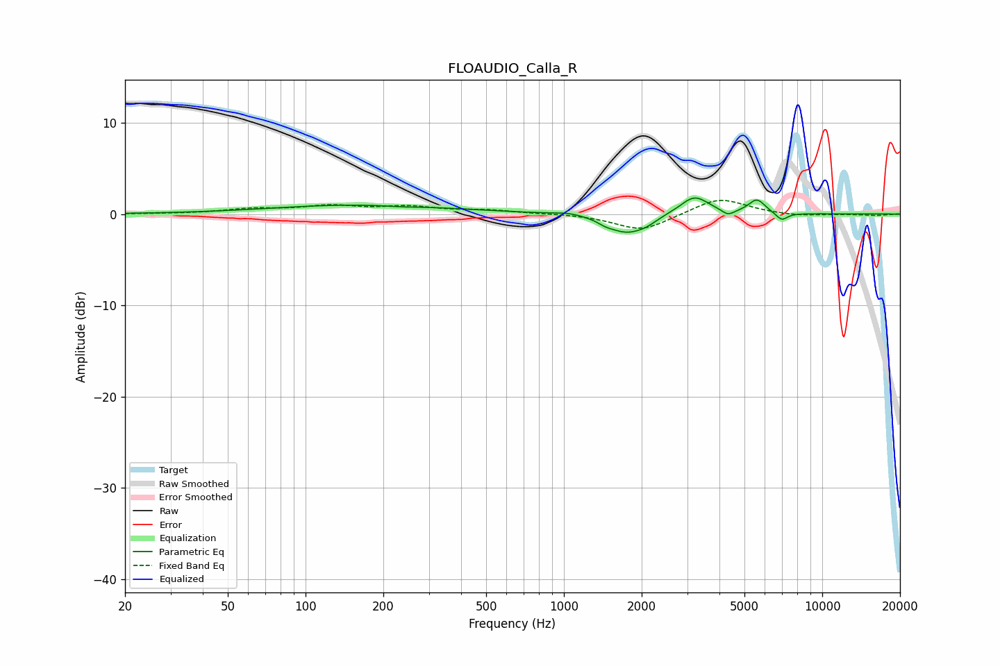

# FLOAUDIO_Calla_R
See [usage instructions](https://github.com/jaakkopasanen/AutoEq#usage) for more options and info.

### Parametric EQs
Apply preamp of -1.9 dB when using parametric equalizer.

|   # | Type    |   Fc (Hz) |    Q |   Gain (dB) |
|-----|---------|-----------|------|-------------|
|   1 | Peaking |       166 | 0.41 |         1   |
|   2 | Peaking |       234 | 1.98 |        -0.1 |
|   3 | Peaking |      1043 | 2.58 |         0.3 |
|   4 | Peaking |      1453 | 4.71 |        -0.3 |
|   5 | Peaking |      1750 | 1.98 |        -2   |
|   6 | Peaking |      2088 | 3.51 |        -0.5 |
|   7 | Peaking |      3202 | 2.54 |         2   |
|   8 | Peaking |      4316 | 5.92 |        -0.6 |
|   9 | Peaking |      5587 | 4.34 |         1.5 |
|  10 | Peaking |      6971 | 6    |        -0.9 |

### Fixed Band EQs
When using fixed band (also called graphic) equalizer, apply preamp of **-1.6 dB** (if available) and set gains manually with these parameters.

|   # | Type    |   Fc (Hz) |    Q |   Gain (dB) |
|-----|---------|-----------|------|-------------|
|   1 | Peaking |        31 | 1.41 |         0   |
|   2 | Peaking |        62 | 1.41 |         0.5 |
|   3 | Peaking |       125 | 1.41 |         0.8 |
|   4 | Peaking |       250 | 1.41 |         0.7 |
|   5 | Peaking |       500 | 1.41 |         0.4 |
|   6 | Peaking |      1000 | 1.41 |         0.1 |
|   7 | Peaking |      2000 | 1.41 |        -1.9 |
|   8 | Peaking |      4000 | 1.41 |         1.8 |
|   9 | Peaking |      8000 | 1.41 |        -0.2 |
|  10 | Peaking |     16000 | 1.41 |        -0.2 |

### Graphs

