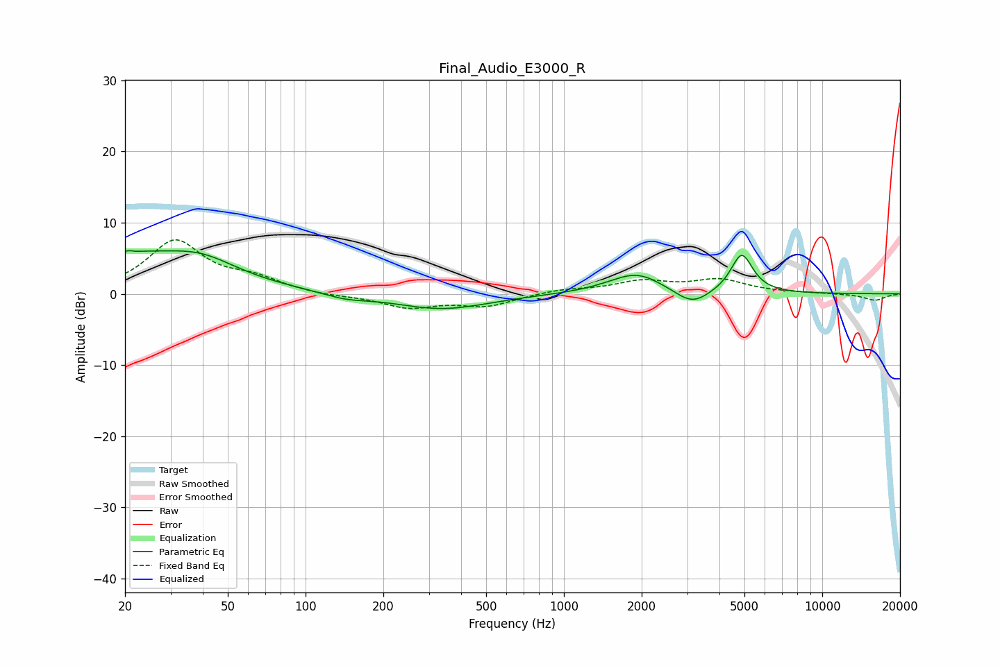

# Final_Audio_E3000_R
See [usage instructions](https://github.com/jaakkopasanen/AutoEq#usage) for more options and info.

### Parametric EQs
Apply preamp of -6.2 dB when using parametric equalizer.

|   # | Type    |   Fc (Hz) |    Q |   Gain (dB) |
|-----|---------|-----------|------|-------------|
|   1 | Peaking |        21 | 5.62 |         3.4 |
|   2 | Peaking |        21 | 5.97 |        -3   |
|   3 | Peaking |        23 | 0.51 |         5.1 |
|   4 | Peaking |        40 | 1.12 |         2   |
|   5 | Peaking |       143 | 1.66 |        -0.7 |
|   6 | Peaking |       337 | 0.78 |        -2.2 |
|   7 | Peaking |      1867 | 1.29 |         2.5 |
|   8 | Peaking |      2017 | 1.98 |         0.5 |
|   9 | Peaking |      3137 | 2.15 |        -2.2 |
|  10 | Peaking |      4879 | 3.3  |         5.6 |

### Fixed Band EQs
When using fixed band (also called graphic) equalizer, apply preamp of **-7.7 dB** (if available) and set gains manually with these parameters.

|   # | Type    |   Fc (Hz) |    Q |   Gain (dB) |
|-----|---------|-----------|------|-------------|
|   1 | Peaking |        31 | 1.41 |         7.3 |
|   2 | Peaking |        62 | 1.41 |         1.8 |
|   3 | Peaking |       125 | 1.41 |        -0.3 |
|   4 | Peaking |       250 | 1.41 |        -1.8 |
|   5 | Peaking |       500 | 1.41 |        -1.6 |
|   6 | Peaking |      1000 | 1.41 |         0.6 |
|   7 | Peaking |      2000 | 1.41 |         1.6 |
|   8 | Peaking |      4000 | 1.41 |         1.8 |
|   9 | Peaking |      8000 | 1.41 |         0.1 |
|  10 | Peaking |     16000 | 1.41 |        -0.9 |

### Graphs

