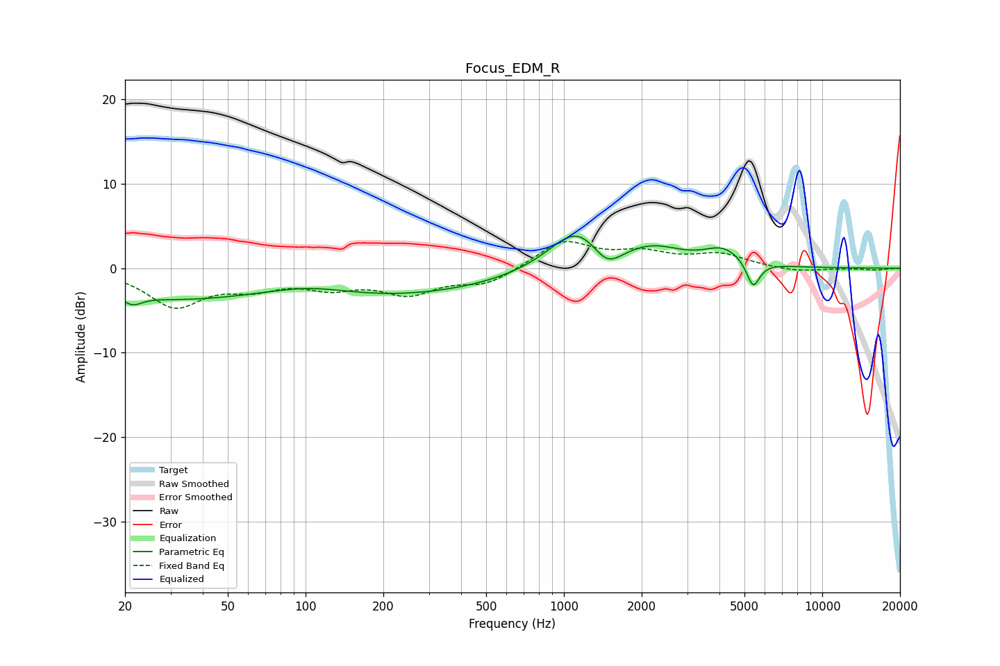

# Focus_EDM_R
See [usage instructions](https://github.com/jaakkopasanen/AutoEq#usage) for more options and info.

### Parametric EQs
Apply preamp of -3.9 dB when using parametric equalizer.

|   # | Type    |   Fc (Hz) |    Q |   Gain (dB) |
|-----|---------|-----------|------|-------------|
|   1 | Peaking |        21 | 3.65 |        -1.3 |
|   2 | Peaking |        28 | 0.52 |        -2.7 |
|   3 | Peaking |       102 | 0.87 |         1.2 |
|   4 | Peaking |       146 | 0.29 |        -2.7 |
|   5 | Peaking |       374 | 0.34 |        -0.9 |
|   6 | Peaking |      1129 | 1.28 |         5.2 |
|   7 | Peaking |      1466 | 2.4  |        -2.8 |
|   8 | Peaking |      2214 | 1.24 |         2.1 |
|   9 | Peaking |      4144 | 1.87 |         2   |
|  10 | Peaking |      5403 | 5.44 |        -3.2 |

### Fixed Band EQs
When using fixed band (also called graphic) equalizer, apply preamp of **-3.2 dB** (if available) and set gains manually with these parameters.

|   # | Type    |   Fc (Hz) |    Q |   Gain (dB) |
|-----|---------|-----------|------|-------------|
|   1 | Peaking |        31 | 1.41 |        -4.3 |
|   2 | Peaking |        62 | 1.41 |        -1.8 |
|   3 | Peaking |       125 | 1.41 |        -1.9 |
|   4 | Peaking |       250 | 1.41 |        -2.7 |
|   5 | Peaking |       500 | 1.41 |        -1.8 |
|   6 | Peaking |      1000 | 1.41 |         3.2 |
|   7 | Peaking |      2000 | 1.41 |         1.6 |
|   8 | Peaking |      4000 | 1.41 |         1.5 |
|   9 | Peaking |      8000 | 1.41 |        -0.5 |
|  10 | Peaking |     16000 | 1.41 |        -0.2 |

### Graphs

