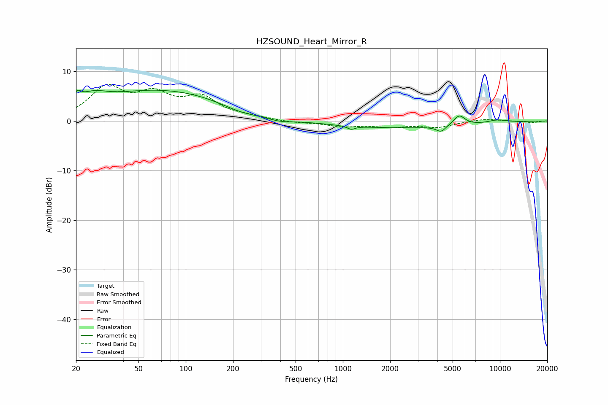

# HZSOUND_Heart_Mirror_R
See [usage instructions](https://github.com/jaakkopasanen/AutoEq#usage) for more options and info.

### Parametric EQs
Apply preamp of -6.3 dB when using parametric equalizer.

|   # | Type    |   Fc (Hz) |    Q |   Gain (dB) |
|-----|---------|-----------|------|-------------|
|   1 | Peaking |        20 | 5.67 |         1.8 |
|   2 | Peaking |        26 | 1.7  |         1.9 |
|   3 | Peaking |        70 | 0.31 |         6.2 |
|   4 | Peaking |       223 | 1.1  |        -1.2 |
|   5 | Peaking |       395 | 1.6  |        -0.8 |
|   6 | Peaking |      1130 | 5.93 |        -0.7 |
|   7 | Peaking |      2343 | 0.28 |        -1.4 |
|   8 | Peaking |      4219 | 4.72 |        -1.2 |
|   9 | Peaking |      5504 | 3.72 |         2.1 |
|  10 | Peaking |      9623 | 1.92 |         0.7 |

### Fixed Band EQs
When using fixed band (also called graphic) equalizer, apply preamp of **-7.5 dB** (if available) and set gains manually with these parameters.

|   # | Type    |   Fc (Hz) |    Q |   Gain (dB) |
|-----|---------|-----------|------|-------------|
|   1 | Peaking |        31 | 1.41 |         6.3 |
|   2 | Peaking |        62 | 1.41 |         4.5 |
|   3 | Peaking |       125 | 1.41 |         4.2 |
|   4 | Peaking |       250 | 1.41 |         0.6 |
|   5 | Peaking |       500 | 1.41 |        -0.4 |
|   6 | Peaking |      1000 | 1.41 |        -1   |
|   7 | Peaking |      2000 | 1.41 |        -1   |
|   8 | Peaking |      4000 | 1.41 |        -1.2 |
|   9 | Peaking |      8000 | 1.41 |         0.5 |
|  10 | Peaking |     16000 | 1.41 |        -0.4 |

### Graphs

