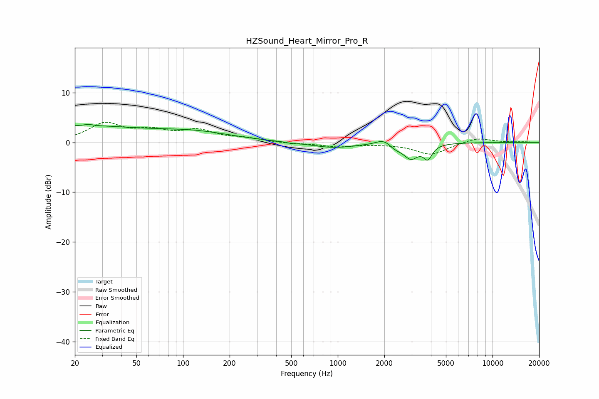

# HZSound_Heart_Mirror_Pro_R
See [usage instructions](https://github.com/jaakkopasanen/AutoEq#usage) for more options and info.

### Parametric EQs
Apply preamp of -3.7 dB when using parametric equalizer.

|   # | Type    |   Fc (Hz) |    Q |   Gain (dB) |
|-----|---------|-----------|------|-------------|
|   1 | Peaking |        20 | 0.31 |         3.2 |
|   2 | Peaking |        25 | 5.99 |         0.3 |
|   3 | Peaking |       121 | 0.58 |         1.7 |
|   4 | Peaking |       507 | 6    |        -0.2 |
|   5 | Peaking |       930 | 1.01 |        -1.1 |
|   6 | Peaking |      1961 | 2.99 |         1.2 |
|   7 | Peaking |      2142 | 4.17 |         0.5 |
|   8 | Peaking |      2277 | 2.72 |        -1.2 |
|   9 | Peaking |      2973 | 3.05 |        -2.8 |
|  10 | Peaking |      3820 | 5.07 |        -2.7 |

### Fixed Band EQs
When using fixed band (also called graphic) equalizer, apply preamp of **-4.1 dB** (if available) and set gains manually with these parameters.

|   # | Type    |   Fc (Hz) |    Q |   Gain (dB) |
|-----|---------|-----------|------|-------------|
|   1 | Peaking |        31 | 1.41 |         3.6 |
|   2 | Peaking |        62 | 1.41 |         2   |
|   3 | Peaking |       125 | 1.41 |         2.1 |
|   4 | Peaking |       250 | 1.41 |         0.7 |
|   5 | Peaking |       500 | 1.41 |        -0.2 |
|   6 | Peaking |      1000 | 1.41 |        -0.8 |
|   7 | Peaking |      2000 | 1.41 |        -0.2 |
|   8 | Peaking |      4000 | 1.41 |        -2.4 |
|   9 | Peaking |      8000 | 1.41 |         1   |
|  10 | Peaking |     16000 | 1.41 |         0.1 |

### Graphs

