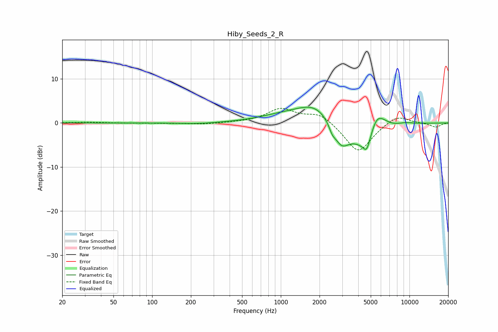

# Hiby_Seeds_2_R
See [usage instructions](https://github.com/jaakkopasanen/AutoEq#usage) for more options and info.

### Parametric EQs
Apply preamp of -3.7 dB when using parametric equalizer.

|   # | Type    |   Fc (Hz) |    Q |   Gain (dB) |
|-----|---------|-----------|------|-------------|
|   1 | Peaking |       229 | 1.06 |        -0.3 |
|   2 | Peaking |      1040 | 0.74 |         1.3 |
|   3 | Peaking |      1872 | 0.99 |         4.1 |
|   4 | Peaking |      2508 | 5.96 |        -1.4 |
|   5 | Peaking |      2948 | 2.15 |        -5.4 |
|   6 | Peaking |      4627 | 1.4  |        -6   |
|   7 | Peaking |      4648 | 6    |        -2.2 |
|   8 | Peaking |      5513 | 2.7  |         4.5 |
|   9 | Peaking |      6248 | 2.53 |         1.2 |
|  10 | Peaking |      9310 | 2.15 |         0.4 |

### Fixed Band EQs
When using fixed band (also called graphic) equalizer, apply preamp of **-3.4 dB** (if available) and set gains manually with these parameters.

|   # | Type    |   Fc (Hz) |    Q |   Gain (dB) |
|-----|---------|-----------|------|-------------|
|   1 | Peaking |        31 | 1.41 |         0.2 |
|   2 | Peaking |        62 | 1.41 |        -0   |
|   3 | Peaking |       125 | 1.41 |        -0.1 |
|   4 | Peaking |       250 | 1.41 |        -0.3 |
|   5 | Peaking |       500 | 1.41 |         0.1 |
|   6 | Peaking |      1000 | 1.41 |         3.1 |
|   7 | Peaking |      2000 | 1.41 |         2.3 |
|   8 | Peaking |      4000 | 1.41 |        -6.9 |
|   9 | Peaking |      8000 | 1.41 |         2   |
|  10 | Peaking |     16000 | 1.41 |        -1   |

### Graphs

