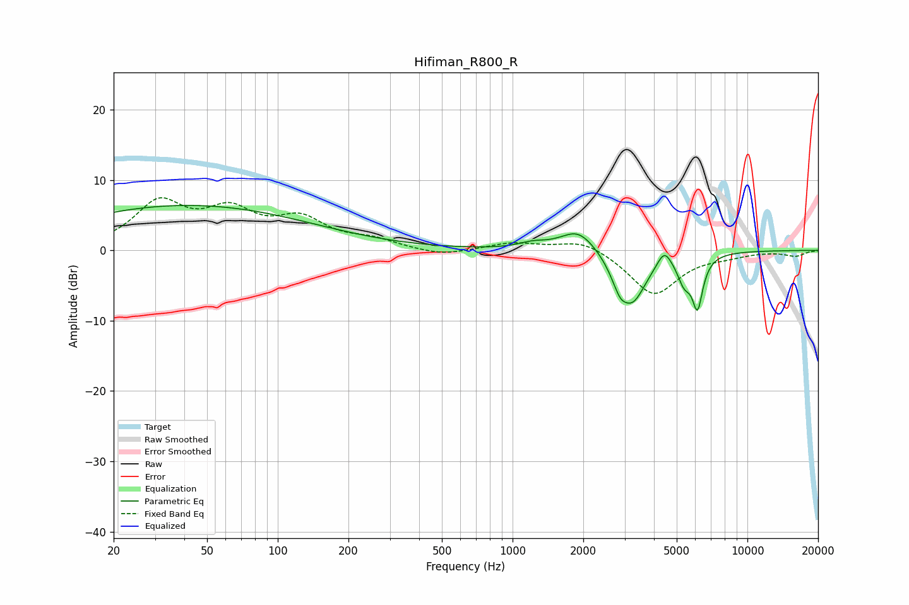

# Hifiman_R800_R
See [usage instructions](https://github.com/jaakkopasanen/AutoEq#usage) for more options and info.

### Parametric EQs
Apply preamp of -6.5 dB when using parametric equalizer.

|   # | Type    |   Fc (Hz) |    Q |   Gain (dB) |
|-----|---------|-----------|------|-------------|
|   1 | Peaking |        41 | 0.26 |         6.4 |
|   2 | Peaking |      1218 | 2.4  |         0.7 |
|   3 | Peaking |      1907 | 1.84 |         3.2 |
|   4 | Peaking |      2742 | 4.2  |        -1   |
|   5 | Peaking |      2889 | 5.83 |        -1.4 |
|   6 | Peaking |      3228 | 2.28 |        -7.3 |
|   7 | Peaking |      4429 | 4.68 |         2.4 |
|   8 | Peaking |      5379 | 4.75 |        -3.3 |
|   9 | Peaking |      6099 | 5.97 |         1   |
|  10 | Peaking |      6128 | 6    |        -8.1 |

### Fixed Band EQs
When using fixed band (also called graphic) equalizer, apply preamp of **-7.6 dB** (if available) and set gains manually with these parameters.

|   # | Type    |   Fc (Hz) |    Q |   Gain (dB) |
|-----|---------|-----------|------|-------------|
|   1 | Peaking |        31 | 1.41 |         6.4 |
|   2 | Peaking |        62 | 1.41 |         4.8 |
|   3 | Peaking |       125 | 1.41 |         3.9 |
|   4 | Peaking |       250 | 1.41 |         1.2 |
|   5 | Peaking |       500 | 1.41 |        -0.9 |
|   6 | Peaking |      1000 | 1.41 |         1.1 |
|   7 | Peaking |      2000 | 1.41 |         1.7 |
|   8 | Peaking |      4000 | 1.41 |        -6.4 |
|   9 | Peaking |      8000 | 1.41 |        -0.6 |
|  10 | Peaking |     16000 | 1.41 |        -0.8 |

### Graphs

