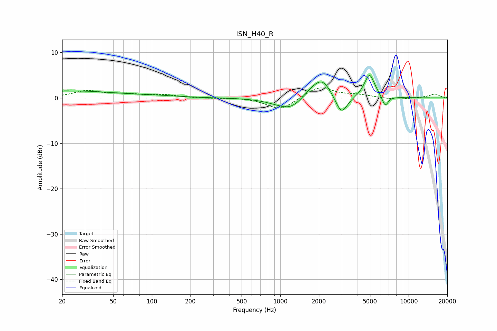

# ISN_H40_R
See [usage instructions](https://github.com/jaakkopasanen/AutoEq#usage) for more options and info.

### Parametric EQs
Apply preamp of -5.0 dB when using parametric equalizer.

|   # | Type    |   Fc (Hz) |    Q |   Gain (dB) |
|-----|---------|-----------|------|-------------|
|   1 | Peaking |        21 | 6    |         0.1 |
|   2 | Peaking |        25 | 0.44 |         1.5 |
|   3 | Peaking |       107 | 0.77 |         0.3 |
|   4 | Peaking |       925 | 1.27 |        -0.5 |
|   5 | Peaking |      1203 | 1.52 |        -2.3 |
|   6 | Peaking |      1765 | 1.98 |         1.5 |
|   7 | Peaking |      2140 | 2.11 |         3.7 |
|   8 | Peaking |      2998 | 3.07 |        -4.2 |
|   9 | Peaking |      4957 | 3.44 |         5.3 |
|  10 | Peaking |      6566 | 5.64 |        -2.4 |

### Fixed Band EQs
When using fixed band (also called graphic) equalizer, apply preamp of **-2.3 dB** (if available) and set gains manually with these parameters.

|   # | Type    |   Fc (Hz) |    Q |   Gain (dB) |
|-----|---------|-----------|------|-------------|
|   1 | Peaking |        31 | 1.41 |         1.5 |
|   2 | Peaking |        62 | 1.41 |         0.7 |
|   3 | Peaking |       125 | 1.41 |         0.6 |
|   4 | Peaking |       250 | 1.41 |        -0.1 |
|   5 | Peaking |       500 | 1.41 |         0.1 |
|   6 | Peaking |      1000 | 1.41 |        -2.7 |
|   7 | Peaking |      2000 | 1.41 |         2.6 |
|   8 | Peaking |      4000 | 1.41 |         0.6 |
|   9 | Peaking |      8000 | 1.41 |        -0.4 |
|  10 | Peaking |     16000 | 1.41 |         0.9 |

### Graphs

