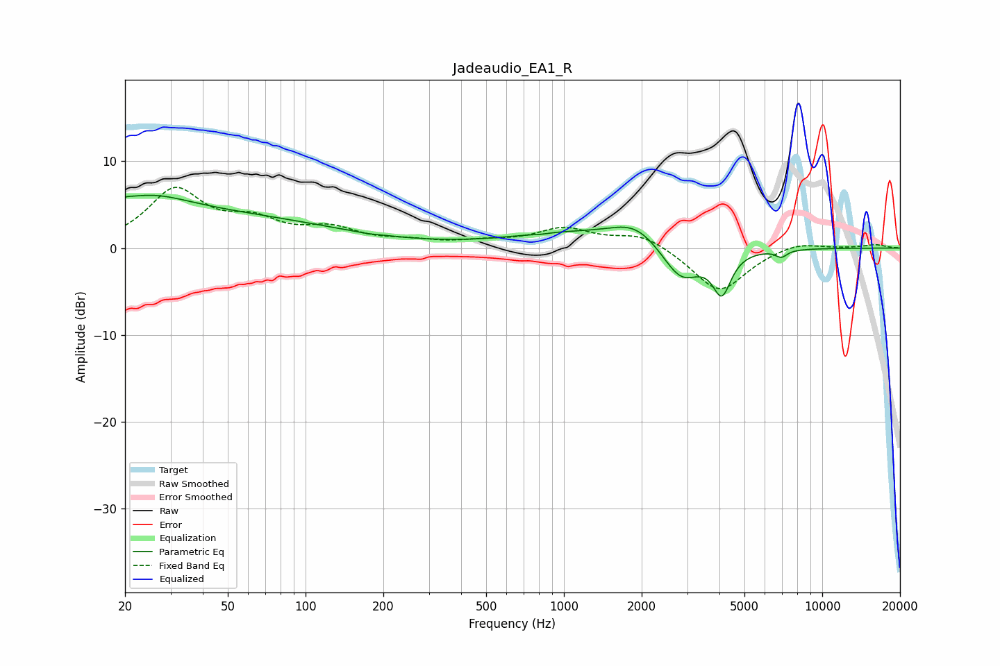

# Jadeaudio_EA1_R
See [usage instructions](https://github.com/jaakkopasanen/AutoEq#usage) for more options and info.

### Parametric EQs
Apply preamp of -6.2 dB when using parametric equalizer.

|   # | Type    |   Fc (Hz) |    Q |   Gain (dB) |
|-----|---------|-----------|------|-------------|
|   1 | Peaking |        20 | 5.84 |         0.2 |
|   2 | Peaking |        25 | 0.93 |         2   |
|   3 | Peaking |        28 | 0.2  |         4   |
|   4 | Peaking |       171 | 3.93 |        -0.1 |
|   5 | Peaking |       814 | 5.88 |        -0.1 |
|   6 | Peaking |      1019 | 0.62 |         1.5 |
|   7 | Peaking |      1898 | 1.42 |         2.5 |
|   8 | Peaking |      2842 | 1.86 |        -4.2 |
|   9 | Peaking |      4087 | 3.99 |        -4.7 |
|  10 | Peaking |      6947 | 6    |        -0.8 |

### Fixed Band EQs
When using fixed band (also called graphic) equalizer, apply preamp of **-7.1 dB** (if available) and set gains manually with these parameters.

|   # | Type    |   Fc (Hz) |    Q |   Gain (dB) |
|-----|---------|-----------|------|-------------|
|   1 | Peaking |        31 | 1.41 |         6.5 |
|   2 | Peaking |        62 | 1.41 |         2.5 |
|   3 | Peaking |       125 | 1.41 |         1.9 |
|   4 | Peaking |       250 | 1.41 |         0.6 |
|   5 | Peaking |       500 | 1.41 |         0.6 |
|   6 | Peaking |      1000 | 1.41 |         2.1 |
|   7 | Peaking |      2000 | 1.41 |         1.7 |
|   8 | Peaking |      4000 | 1.41 |        -5.2 |
|   9 | Peaking |      8000 | 1.41 |         0.8 |
|  10 | Peaking |     16000 | 1.41 |         0.4 |

### Graphs

