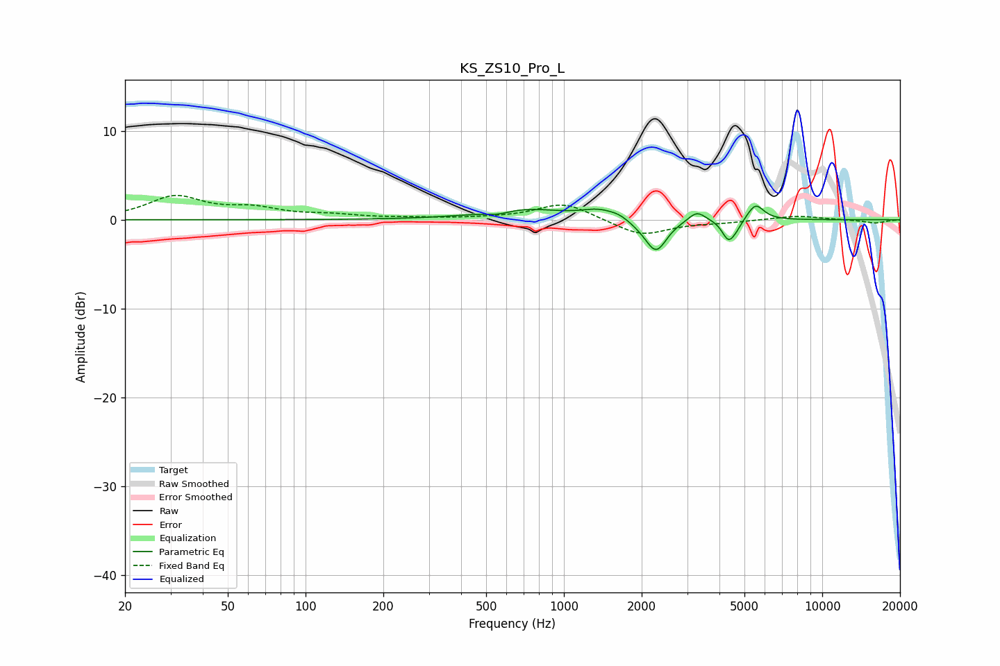

# KS_ZS10_Pro_L
See [usage instructions](https://github.com/jaakkopasanen/AutoEq#usage) for more options and info.

### Parametric EQs
Apply preamp of -1.6 dB when using parametric equalizer.

|   # | Type    |   Fc (Hz) |    Q |   Gain (dB) |
|-----|---------|-----------|------|-------------|
|   1 | Peaking |       556 | 2.88 |        -0.4 |
|   2 | Peaking |       685 | 0.92 |         1.2 |
|   3 | Peaking |      1377 | 2.07 |         1   |
|   4 | Peaking |      1644 | 3.87 |         0.4 |
|   5 | Peaking |      2049 | 2.27 |        -0.5 |
|   6 | Peaking |      2277 | 3.49 |        -3.4 |
|   7 | Peaking |      3271 | 4.22 |         1.2 |
|   8 | Peaking |      4326 | 5.9  |        -2.1 |
|   9 | Peaking |      4628 | 5.64 |        -0.8 |
|  10 | Peaking |      5518 | 4.37 |         1.8 |

### Fixed Band EQs
When using fixed band (also called graphic) equalizer, apply preamp of **-2.8 dB** (if available) and set gains manually with these parameters.

|   # | Type    |   Fc (Hz) |    Q |   Gain (dB) |
|-----|---------|-----------|------|-------------|
|   1 | Peaking |        31 | 1.41 |         2.5 |
|   2 | Peaking |        62 | 1.41 |         1.1 |
|   3 | Peaking |       125 | 1.41 |         0.4 |
|   4 | Peaking |       250 | 1.41 |         0.1 |
|   5 | Peaking |       500 | 1.41 |         0.1 |
|   6 | Peaking |      1000 | 1.41 |         1.9 |
|   7 | Peaking |      2000 | 1.41 |        -1.8 |
|   8 | Peaking |      4000 | 1.41 |        -0.3 |
|   9 | Peaking |      8000 | 1.41 |         0.5 |
|  10 | Peaking |     16000 | 1.41 |        -0.4 |

### Graphs

