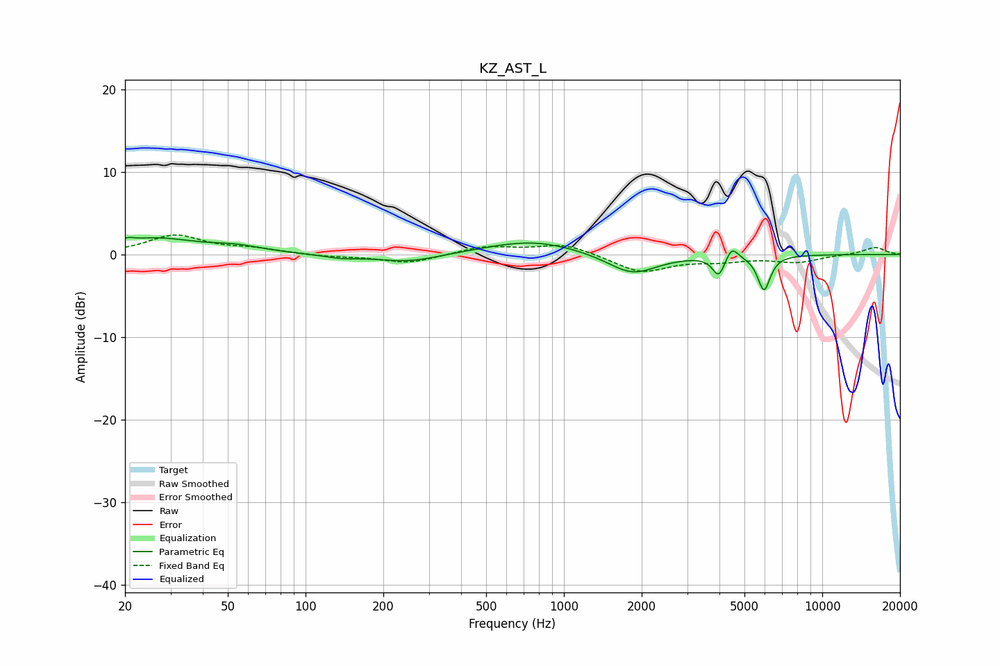

# KZ_AST_L
See [usage instructions](https://github.com/jaakkopasanen/AutoEq#usage) for more options and info.

### Parametric EQs
Apply preamp of -2.2 dB when using parametric equalizer.

|   # | Type    |   Fc (Hz) |    Q |   Gain (dB) |
|-----|---------|-----------|------|-------------|
|   1 | Peaking |        20 | 5.82 |         0.4 |
|   2 | Peaking |        26 | 0.92 |         1.9 |
|   3 | Peaking |        54 | 1.41 |         0.7 |
|   4 | Peaking |       137 | 2.04 |        -0.4 |
|   5 | Peaking |       251 | 1.13 |        -1   |
|   6 | Peaking |       757 | 0.77 |         1.7 |
|   7 | Peaking |      1840 | 1.46 |        -2.6 |
|   8 | Peaking |      3976 | 6    |        -2.5 |
|   9 | Peaking |      4466 | 5.98 |         1.6 |
|  10 | Peaking |      5951 | 5.73 |        -4.2 |

### Fixed Band EQs
When using fixed band (also called graphic) equalizer, apply preamp of **-2.4 dB** (if available) and set gains manually with these parameters.

|   # | Type    |   Fc (Hz) |    Q |   Gain (dB) |
|-----|---------|-----------|------|-------------|
|   1 | Peaking |        31 | 1.41 |         2.3 |
|   2 | Peaking |        62 | 1.41 |         0.6 |
|   3 | Peaking |       125 | 1.41 |        -0.3 |
|   4 | Peaking |       250 | 1.41 |        -1.1 |
|   5 | Peaking |       500 | 1.41 |         1   |
|   6 | Peaking |      1000 | 1.41 |         1.3 |
|   7 | Peaking |      2000 | 1.41 |        -2.2 |
|   8 | Peaking |      4000 | 1.41 |        -0.7 |
|   9 | Peaking |      8000 | 1.41 |        -0.9 |
|  10 | Peaking |     16000 | 1.41 |         0.9 |

### Graphs

