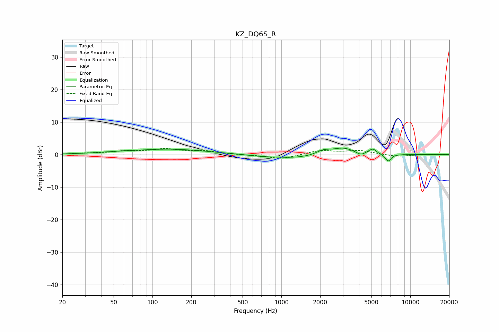

# KZ_DQ6S_R
See [usage instructions](https://github.com/jaakkopasanen/AutoEq#usage) for more options and info.

### Parametric EQs
Apply preamp of -2.1 dB when using parametric equalizer.

|   # | Type    |   Fc (Hz) |    Q |   Gain (dB) |
|-----|---------|-----------|------|-------------|
|   1 | Peaking |        50 | 0.9  |         0.3 |
|   2 | Peaking |       137 | 0.5  |         1.6 |
|   3 | Peaking |       688 | 1.37 |        -0.3 |
|   4 | Peaking |      1288 | 0.75 |        -1.1 |
|   5 | Peaking |      2113 | 2.57 |         1.3 |
|   6 | Peaking |      3021 | 1.57 |         2.1 |
|   7 | Peaking |      4137 | 3.88 |        -1   |
|   8 | Peaking |      4799 | 4.44 |         0.5 |
|   9 | Peaking |      5168 | 5.59 |         1.3 |
|  10 | Peaking |      6743 | 5.97 |        -2.2 |

### Fixed Band EQs
When using fixed band (also called graphic) equalizer, apply preamp of **-1.9 dB** (if available) and set gains manually with these parameters.

|   # | Type    |   Fc (Hz) |    Q |   Gain (dB) |
|-----|---------|-----------|------|-------------|
|   1 | Peaking |        31 | 1.41 |         0.3 |
|   2 | Peaking |        62 | 1.41 |         0.9 |
|   3 | Peaking |       125 | 1.41 |         1.5 |
|   4 | Peaking |       250 | 1.41 |         1   |
|   5 | Peaking |       500 | 1.41 |        -0.1 |
|   6 | Peaking |      1000 | 1.41 |        -1.4 |
|   7 | Peaking |      2000 | 1.41 |         1.2 |
|   8 | Peaking |      4000 | 1.41 |         1.2 |
|   9 | Peaking |      8000 | 1.41 |        -0.7 |
|  10 | Peaking |     16000 | 1.41 |        -0   |

### Graphs

