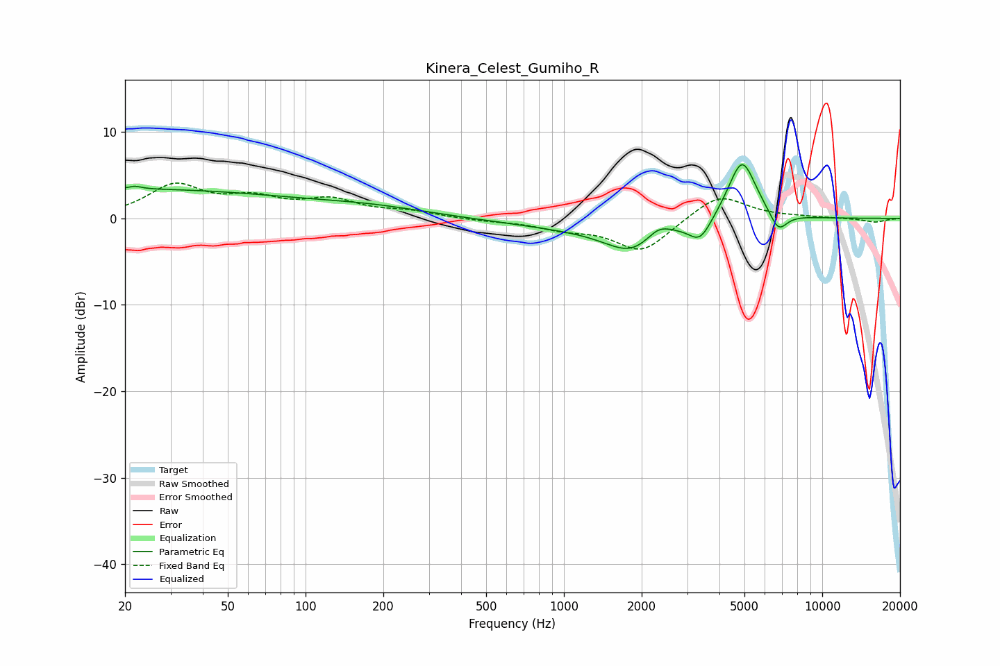

# Kinera_Celest_Gumiho_R
See [usage instructions](https://github.com/jaakkopasanen/AutoEq#usage) for more options and info.

### Parametric EQs
Apply preamp of -6.3 dB when using parametric equalizer.

|   # | Type    |   Fc (Hz) |    Q |   Gain (dB) |
|-----|---------|-----------|------|-------------|
|   1 | Peaking |        21 | 5.97 |        -2.9 |
|   2 | Peaking |        21 | 5.75 |         3.2 |
|   3 | Peaking |        22 | 0.21 |         3.3 |
|   4 | Peaking |       180 | 0.61 |         1   |
|   5 | Peaking |      1296 | 0.46 |        -1.1 |
|   6 | Peaking |      1834 | 1.38 |        -3   |
|   7 | Peaking |      2325 | 2.88 |         1.5 |
|   8 | Peaking |      3367 | 3.21 |        -2.5 |
|   9 | Peaking |      4891 | 2.52 |         7.2 |
|  10 | Peaking |      6763 | 4.03 |        -2.3 |

### Fixed Band EQs
When using fixed band (also called graphic) equalizer, apply preamp of **-4.2 dB** (if available) and set gains manually with these parameters.

|   # | Type    |   Fc (Hz) |    Q |   Gain (dB) |
|-----|---------|-----------|------|-------------|
|   1 | Peaking |        31 | 1.41 |         3.7 |
|   2 | Peaking |        62 | 1.41 |         1.9 |
|   3 | Peaking |       125 | 1.41 |         1.9 |
|   4 | Peaking |       250 | 1.41 |         0.7 |
|   5 | Peaking |       500 | 1.41 |        -0.2 |
|   6 | Peaking |      1000 | 1.41 |        -1   |
|   7 | Peaking |      2000 | 1.41 |        -3.8 |
|   8 | Peaking |      4000 | 1.41 |         2.9 |
|   9 | Peaking |      8000 | 1.41 |         0.1 |
|  10 | Peaking |     16000 | 1.41 |        -0.4 |

### Graphs

