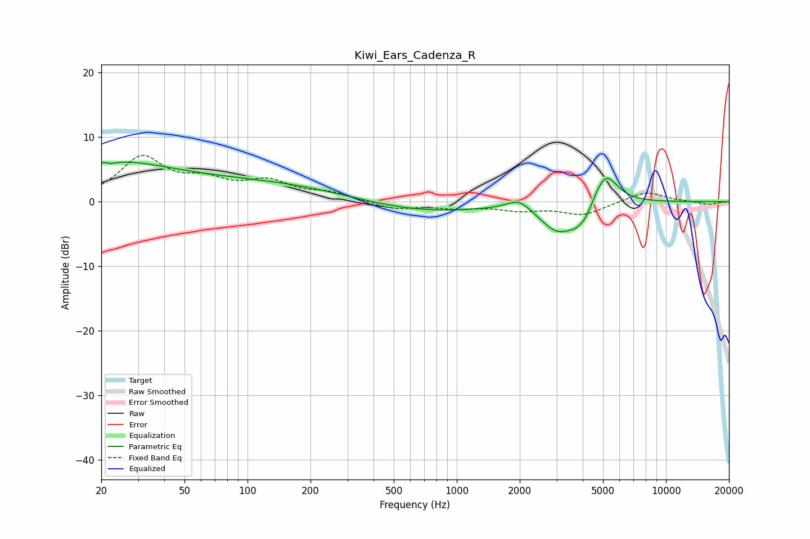

# Kiwi_Ears_Cadenza_R
See [usage instructions](https://github.com/jaakkopasanen/AutoEq#usage) for more options and info.

### Parametric EQs
Apply preamp of -6.2 dB when using parametric equalizer.

|   # | Type    |   Fc (Hz) |    Q |   Gain (dB) |
|-----|---------|-----------|------|-------------|
|   1 | Peaking |        20 | 4.68 |        -3.6 |
|   2 | Peaking |        20 | 5.71 |         3.3 |
|   3 | Peaking |        21 | 0.44 |         5.9 |
|   4 | Peaking |       134 | 0.35 |         2.7 |
|   5 | Peaking |       626 | 0.45 |        -1.8 |
|   6 | Peaking |      1984 | 2.41 |         1.8 |
|   7 | Peaking |      3079 | 1.59 |        -4.8 |
|   8 | Peaking |      3722 | 4.27 |        -1.2 |
|   9 | Peaking |      4148 | 4.15 |        -1.6 |
|  10 | Peaking |      5131 | 2.35 |         5.2 |

### Fixed Band EQs
When using fixed band (also called graphic) equalizer, apply preamp of **-7.3 dB** (if available) and set gains manually with these parameters.

|   # | Type    |   Fc (Hz) |    Q |   Gain (dB) |
|-----|---------|-----------|------|-------------|
|   1 | Peaking |        31 | 1.41 |         6.6 |
|   2 | Peaking |        62 | 1.41 |         2.6 |
|   3 | Peaking |       125 | 1.41 |         2.8 |
|   4 | Peaking |       250 | 1.41 |         1.2 |
|   5 | Peaking |       500 | 1.41 |        -1.2 |
|   6 | Peaking |      1000 | 1.41 |        -0.8 |
|   7 | Peaking |      2000 | 1.41 |        -1.1 |
|   8 | Peaking |      4000 | 1.41 |        -2   |
|   9 | Peaking |      8000 | 1.41 |         1.6 |
|  10 | Peaking |     16000 | 1.41 |        -0.5 |

### Graphs

