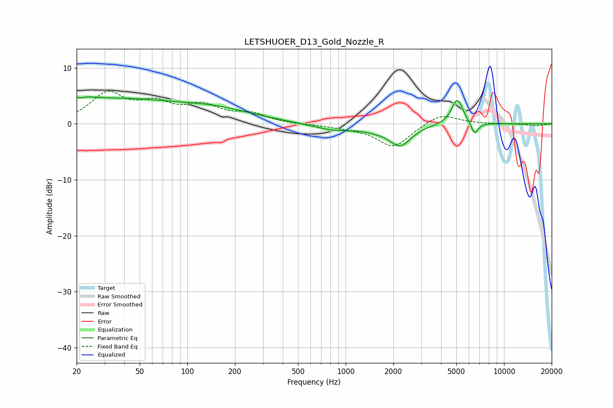

# LETSHUOER_D13_Gold_Nozzle_R
See [usage instructions](https://github.com/jaakkopasanen/AutoEq#usage) for more options and info.

### Parametric EQs
Apply preamp of -4.9 dB when using parametric equalizer.

|   # | Type    |   Fc (Hz) |    Q |   Gain (dB) |
|-----|---------|-----------|------|-------------|
|   1 | Peaking |        20 | 0.22 |         4.9 |
|   2 | Peaking |        21 | 5.78 |         3.3 |
|   3 | Peaking |        21 | 5.99 |        -3.5 |
|   4 | Peaking |        31 | 1.46 |        -0.3 |
|   5 | Peaking |       154 | 0.57 |         2   |
|   6 | Peaking |       857 | 1.06 |        -1.1 |
|   7 | Peaking |      1541 | 1.99 |        -0.5 |
|   8 | Peaking |      2209 | 2.06 |        -3.7 |
|   9 | Peaking |      5074 | 3.81 |         4.6 |
|  10 | Peaking |      6522 | 5.91 |        -2.2 |

### Fixed Band EQs
When using fixed band (also called graphic) equalizer, apply preamp of **-5.9 dB** (if available) and set gains manually with these parameters.

|   # | Type    |   Fc (Hz) |    Q |   Gain (dB) |
|-----|---------|-----------|------|-------------|
|   1 | Peaking |        31 | 1.41 |         5.1 |
|   2 | Peaking |        62 | 1.41 |         3.1 |
|   3 | Peaking |       125 | 1.41 |         2.8 |
|   4 | Peaking |       250 | 1.41 |         1.6 |
|   5 | Peaking |       500 | 1.41 |        -0.1 |
|   6 | Peaking |      1000 | 1.41 |        -0.5 |
|   7 | Peaking |      2000 | 1.41 |        -4.2 |
|   8 | Peaking |      4000 | 1.41 |         2   |
|   9 | Peaking |      8000 | 1.41 |        -0   |
|  10 | Peaking |     16000 | 1.41 |        -0.3 |

### Graphs

