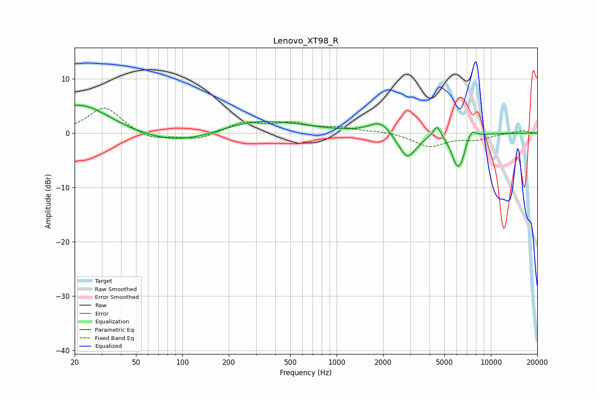

# Lenovo_XT98_R
See [usage instructions](https://github.com/jaakkopasanen/AutoEq#usage) for more options and info.

### Parametric EQs
Apply preamp of -5.2 dB when using parametric equalizer.

|   # | Type    |   Fc (Hz) |    Q |   Gain (dB) |
|-----|---------|-----------|------|-------------|
|   1 | Peaking |        22 | 0.72 |         5.5 |
|   2 | Peaking |       117 | 0.45 |        -3.6 |
|   3 | Peaking |       250 | 0.45 |         3.9 |
|   4 | Peaking |      1909 | 2.08 |         2.3 |
|   5 | Peaking |      2856 | 2.51 |        -4.2 |
|   6 | Peaking |      2985 | 2.45 |        -0.7 |
|   7 | Peaking |      4473 | 5.38 |         2.4 |
|   8 | Peaking |      6038 | 3.69 |        -5.4 |
|   9 | Peaking |      6496 | 6    |        -1.6 |
|  10 | Peaking |      7518 | 4.88 |         1.5 |

### Fixed Band EQs
When using fixed band (also called graphic) equalizer, apply preamp of **-4.7 dB** (if available) and set gains manually with these parameters.

|   # | Type    |   Fc (Hz) |    Q |   Gain (dB) |
|-----|---------|-----------|------|-------------|
|   1 | Peaking |        31 | 1.41 |         4.9 |
|   2 | Peaking |        62 | 1.41 |        -1.4 |
|   3 | Peaking |       125 | 1.41 |        -1.2 |
|   4 | Peaking |       250 | 1.41 |         1.9 |
|   5 | Peaking |       500 | 1.41 |         1.6 |
|   6 | Peaking |      1000 | 1.41 |         0.9 |
|   7 | Peaking |      2000 | 1.41 |         0.4 |
|   8 | Peaking |      4000 | 1.41 |        -2.4 |
|   9 | Peaking |      8000 | 1.41 |        -1.1 |
|  10 | Peaking |     16000 | 1.41 |         0.5 |

### Graphs

