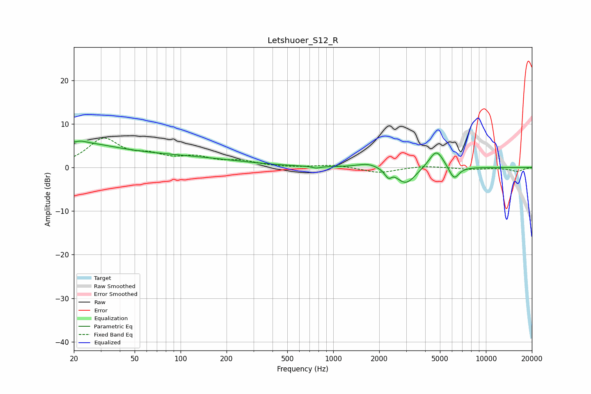

# Letshuoer_S12_R
See [usage instructions](https://github.com/jaakkopasanen/AutoEq#usage) for more options and info.

### Parametric EQs
Apply preamp of -6.2 dB when using parametric equalizer.

|   # | Type    |   Fc (Hz) |    Q |   Gain (dB) |
|-----|---------|-----------|------|-------------|
|   1 | Peaking |        20 | 0.64 |         3.3 |
|   2 | Peaking |        22 | 5.51 |         0.3 |
|   3 | Peaking |        49 | 0.2  |         2.8 |
|   4 | Peaking |       772 | 5.87 |        -0.4 |
|   5 | Peaking |      1698 | 1.92 |         1.1 |
|   6 | Peaking |      2304 | 5.9  |        -1.8 |
|   7 | Peaking |      2460 | 6    |         0.5 |
|   8 | Peaking |      2992 | 2.21 |        -3.9 |
|   9 | Peaking |      4736 | 2.87 |         4.4 |
|  10 | Peaking |      6179 | 4.12 |        -3.1 |

### Fixed Band EQs
When using fixed band (also called graphic) equalizer, apply preamp of **-6.9 dB** (if available) and set gains manually with these parameters.

|   # | Type    |   Fc (Hz) |    Q |   Gain (dB) |
|-----|---------|-----------|------|-------------|
|   1 | Peaking |        31 | 1.41 |         6.3 |
|   2 | Peaking |        62 | 1.41 |         2.1 |
|   3 | Peaking |       125 | 1.41 |         2   |
|   4 | Peaking |       250 | 1.41 |         1.2 |
|   5 | Peaking |       500 | 1.41 |        -0.1 |
|   6 | Peaking |      1000 | 1.41 |         0.6 |
|   7 | Peaking |      2000 | 1.41 |        -1.3 |
|   8 | Peaking |      4000 | 1.41 |         0.4 |
|   9 | Peaking |      8000 | 1.41 |        -0.4 |
|  10 | Peaking |     16000 | 1.41 |        -0.9 |

### Graphs

