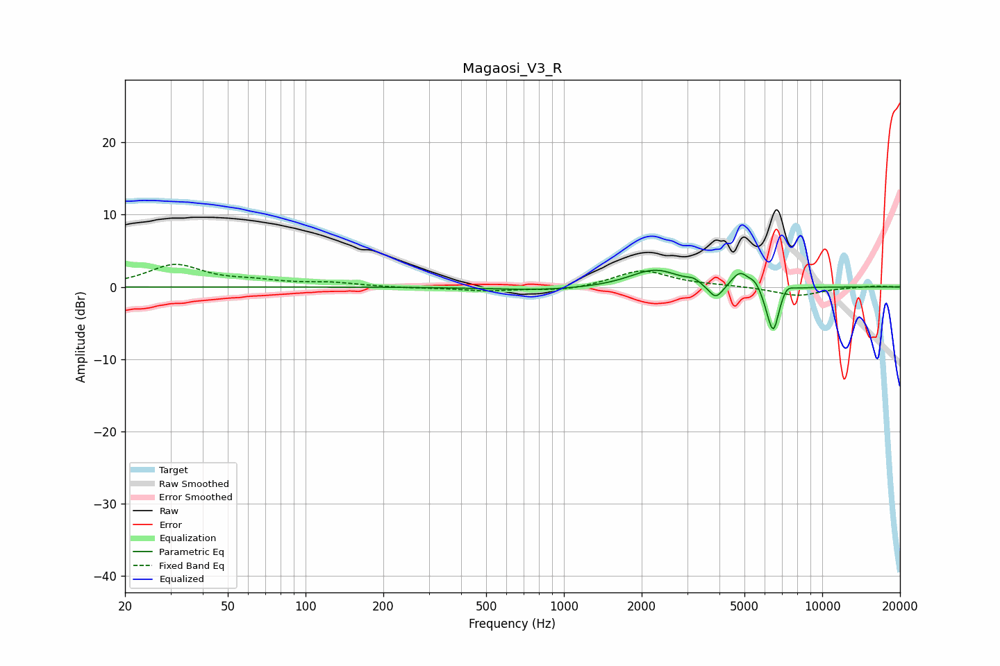

# Magaosi_V3_R
See [usage instructions](https://github.com/jaakkopasanen/AutoEq#usage) for more options and info.

### Parametric EQs
Apply preamp of -2.4 dB when using parametric equalizer.

|   # | Type    |   Fc (Hz) |    Q |   Gain (dB) |
|-----|---------|-----------|------|-------------|
|   1 | Peaking |       812 | 0.74 |        -0.5 |
|   2 | Peaking |      1898 | 1.84 |         0.2 |
|   3 | Peaking |      2273 | 1.54 |         2.3 |
|   4 | Peaking |      3175 | 6    |         0.5 |
|   5 | Peaking |      3875 | 4.76 |        -2.2 |
|   6 | Peaking |      4804 | 4.2  |         2.1 |
|   7 | Peaking |      5501 | 6    |         1   |
|   8 | Peaking |      6176 | 6    |        -1.1 |
|   9 | Peaking |      6477 | 6    |        -5.8 |
|  10 | Peaking |      7295 | 6    |         1   |

### Fixed Band EQs
When using fixed band (also called graphic) equalizer, apply preamp of **-3.2 dB** (if available) and set gains manually with these parameters.

|   # | Type    |   Fc (Hz) |    Q |   Gain (dB) |
|-----|---------|-----------|------|-------------|
|   1 | Peaking |        31 | 1.41 |         3   |
|   2 | Peaking |        62 | 1.41 |         0.6 |
|   3 | Peaking |       125 | 1.41 |         0.5 |
|   4 | Peaking |       250 | 1.41 |        -0.1 |
|   5 | Peaking |       500 | 1.41 |        -0.5 |
|   6 | Peaking |      1000 | 1.41 |        -0.6 |
|   7 | Peaking |      2000 | 1.41 |         2.3 |
|   8 | Peaking |      4000 | 1.41 |         0.2 |
|   9 | Peaking |      8000 | 1.41 |        -1.2 |
|  10 | Peaking |     16000 | 1.41 |         0.2 |

### Graphs

