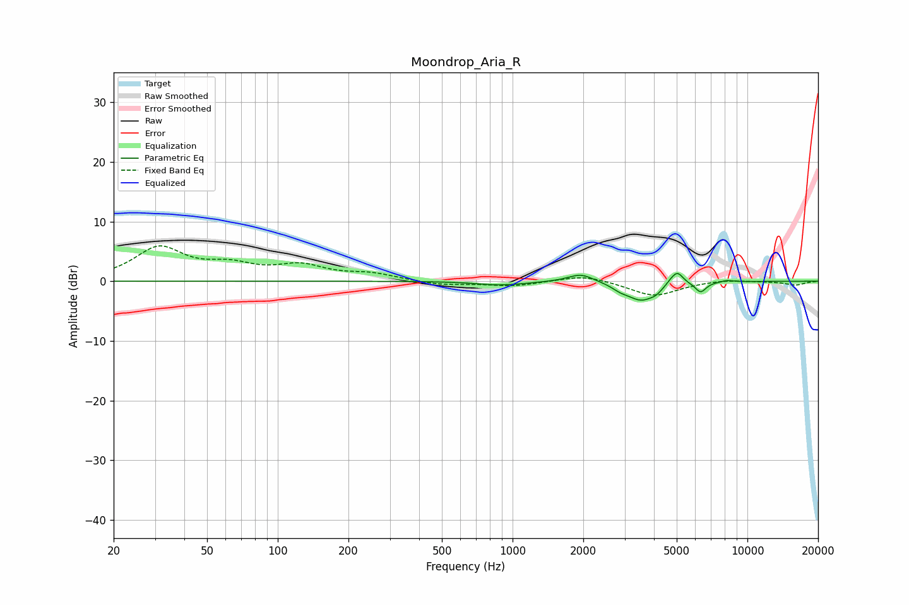

# Moondrop_Aria_R
See [usage instructions](https://github.com/jaakkopasanen/AutoEq#usage) for more options and info.

### Parametric EQs
Apply preamp of -1.4 dB when using parametric equalizer.

|   # | Type    |   Fc (Hz) |    Q |   Gain (dB) |
|-----|---------|-----------|------|-------------|
|   1 | Peaking |       867 | 1.55 |        -0.6 |
|   2 | Peaking |      1128 | 2.85 |        -0.1 |
|   3 | Peaking |      1956 | 2.57 |         1.4 |
|   4 | Peaking |      2876 | 4.13 |        -0.6 |
|   5 | Peaking |      3541 | 2.25 |        -3.1 |
|   6 | Peaking |      4090 | 6    |        -0.6 |
|   7 | Peaking |      4734 | 6    |         0.6 |
|   8 | Peaking |      5042 | 5.78 |         1.9 |
|   9 | Peaking |      6322 | 5.91 |        -1.7 |
|  10 | Peaking |      8190 | 4.94 |         0.3 |

### Fixed Band EQs
When using fixed band (also called graphic) equalizer, apply preamp of **-6.0 dB** (if available) and set gains manually with these parameters.

|   # | Type    |   Fc (Hz) |    Q |   Gain (dB) |
|-----|---------|-----------|------|-------------|
|   1 | Peaking |        31 | 1.41 |         5.4 |
|   2 | Peaking |        62 | 1.41 |         2.2 |
|   3 | Peaking |       125 | 1.41 |         2.3 |
|   4 | Peaking |       250 | 1.41 |         1.1 |
|   5 | Peaking |       500 | 1.41 |        -0.7 |
|   6 | Peaking |      1000 | 1.41 |        -0.8 |
|   7 | Peaking |      2000 | 1.41 |         1.1 |
|   8 | Peaking |      4000 | 1.41 |        -2.5 |
|   9 | Peaking |      8000 | 1.41 |         0.3 |
|  10 | Peaking |     16000 | 1.41 |        -0.6 |

### Graphs

