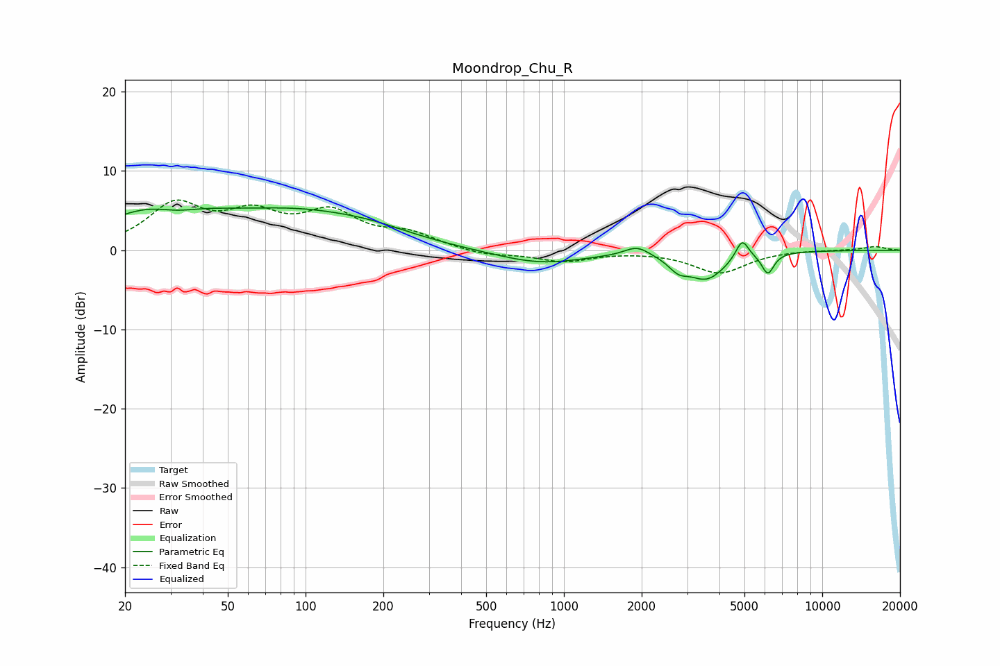

# Moondrop_Chu_R
See [usage instructions](https://github.com/jaakkopasanen/AutoEq#usage) for more options and info.

### Parametric EQs
Apply preamp of -5.4 dB when using parametric equalizer.

|   # | Type    |   Fc (Hz) |    Q |   Gain (dB) |
|-----|---------|-----------|------|-------------|
|   1 | Peaking |        27 | 0.68 |         5.2 |
|   2 | Peaking |        31 | 1.56 |        -1.4 |
|   3 | Peaking |        96 | 0.5  |         4.1 |
|   4 | Peaking |       184 | 0.92 |         0.9 |
|   5 | Peaking |       808 | 0.81 |        -1.7 |
|   6 | Peaking |      1920 | 2.93 |         1.2 |
|   7 | Peaking |      2773 | 3.73 |        -1.4 |
|   8 | Peaking |      3571 | 1.92 |        -3.4 |
|   9 | Peaking |      4898 | 5.6  |         2.6 |
|  10 | Peaking |      6159 | 5.88 |        -2.6 |

### Fixed Band EQs
When using fixed band (also called graphic) equalizer, apply preamp of **-6.4 dB** (if available) and set gains manually with these parameters.

|   # | Type    |   Fc (Hz) |    Q |   Gain (dB) |
|-----|---------|-----------|------|-------------|
|   1 | Peaking |        31 | 1.41 |         5.4 |
|   2 | Peaking |        62 | 1.41 |         3.8 |
|   3 | Peaking |       125 | 1.41 |         4.2 |
|   4 | Peaking |       250 | 1.41 |         1.8 |
|   5 | Peaking |       500 | 1.41 |        -0.7 |
|   6 | Peaking |      1000 | 1.41 |        -1.3 |
|   7 | Peaking |      2000 | 1.41 |        -0   |
|   8 | Peaking |      4000 | 1.41 |        -2.8 |
|   9 | Peaking |      8000 | 1.41 |         0.1 |
|  10 | Peaking |     16000 | 1.41 |         0.5 |

### Graphs

