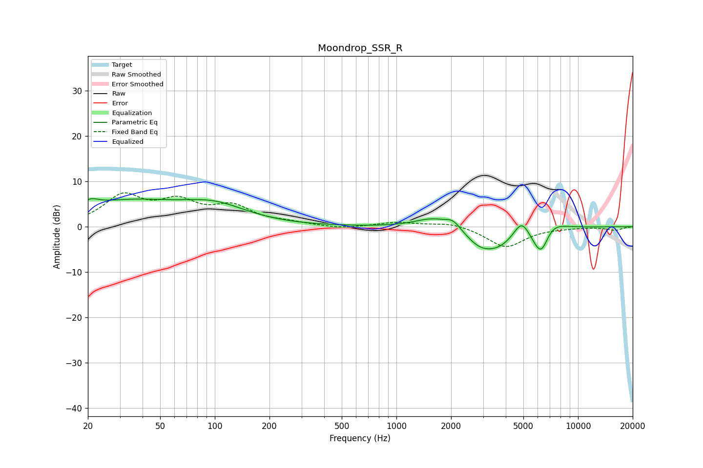

# Moondrop_SSR_R
See [usage instructions](https://github.com/jaakkopasanen/AutoEq#usage) for more options and info.

### Parametric EQs
Apply preamp of -6.3 dB when using parametric equalizer.

|   # | Type    |   Fc (Hz) |    Q |   Gain (dB) |
|-----|---------|-----------|------|-------------|
|   1 | Peaking |        21 | 3.38 |         1.5 |
|   2 | Peaking |        32 | 0.47 |         5.2 |
|   3 | Peaking |       100 | 0.77 |         3.7 |
|   4 | Peaking |      1586 | 1.42 |         2.3 |
|   5 | Peaking |      2052 | 3.24 |         2   |
|   6 | Peaking |      2833 | 2.05 |        -1.6 |
|   7 | Peaking |      3511 | 1.14 |        -4.8 |
|   8 | Peaking |      4894 | 3.02 |         4.5 |
|   9 | Peaking |      6283 | 2.51 |        -9.2 |
|  10 | Peaking |      6831 | 1.82 |         5.1 |

### Fixed Band EQs
When using fixed band (also called graphic) equalizer, apply preamp of **-7.6 dB** (if available) and set gains manually with these parameters.

|   # | Type    |   Fc (Hz) |    Q |   Gain (dB) |
|-----|---------|-----------|------|-------------|
|   1 | Peaking |        31 | 1.41 |         6.4 |
|   2 | Peaking |        62 | 1.41 |         4.7 |
|   3 | Peaking |       125 | 1.41 |         4   |
|   4 | Peaking |       250 | 1.41 |         0.7 |
|   5 | Peaking |       500 | 1.41 |        -0.5 |
|   6 | Peaking |      1000 | 1.41 |         0.9 |
|   7 | Peaking |      2000 | 1.41 |         1   |
|   8 | Peaking |      4000 | 1.41 |        -4.5 |
|   9 | Peaking |      8000 | 1.41 |        -0.1 |
|  10 | Peaking |     16000 | 1.41 |        -0.8 |

### Graphs

