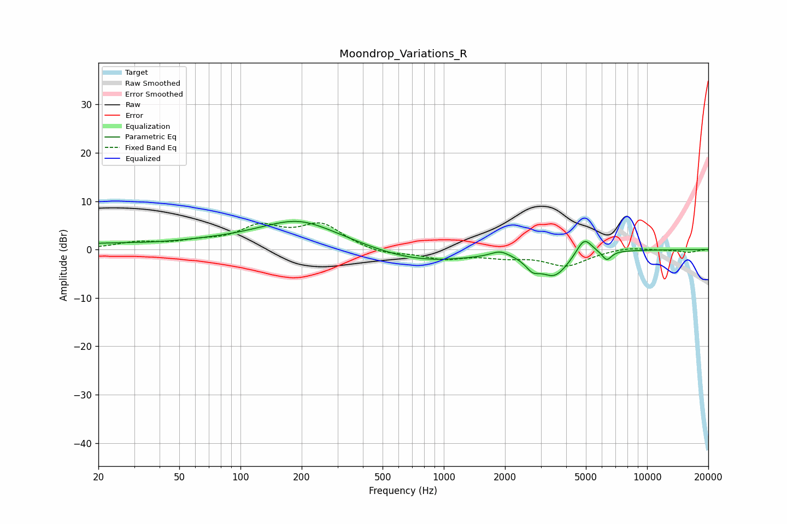

# Moondrop_Variations_R
See [usage instructions](https://github.com/jaakkopasanen/AutoEq#usage) for more options and info.

### Parametric EQs
Apply preamp of -5.9 dB when using parametric equalizer.

|   # | Type    |   Fc (Hz) |    Q |   Gain (dB) |
|-----|---------|-----------|------|-------------|
|   1 | Peaking |        20 | 0.51 |         1   |
|   2 | Peaking |        67 | 0.77 |         0.6 |
|   3 | Peaking |       193 | 0.63 |         5.8 |
|   4 | Peaking |       194 | 1.69 |         0.3 |
|   5 | Peaking |       767 | 0.56 |        -2.7 |
|   6 | Peaking |      1895 | 3.08 |         1.3 |
|   7 | Peaking |      2733 | 4.23 |        -2   |
|   8 | Peaking |      3503 | 1.93 |        -5.1 |
|   9 | Peaking |      4902 | 3.58 |         3.7 |
|  10 | Peaking |      6333 | 5.84 |        -2   |

### Fixed Band EQs
When using fixed band (also called graphic) equalizer, apply preamp of **-5.6 dB** (if available) and set gains manually with these parameters.

|   # | Type    |   Fc (Hz) |    Q |   Gain (dB) |
|-----|---------|-----------|------|-------------|
|   1 | Peaking |        31 | 1.41 |         1.3 |
|   2 | Peaking |        62 | 1.41 |         1.2 |
|   3 | Peaking |       125 | 1.41 |         4.3 |
|   4 | Peaking |       250 | 1.41 |         4.9 |
|   5 | Peaking |       500 | 1.41 |        -1.1 |
|   6 | Peaking |      1000 | 1.41 |        -1.8 |
|   7 | Peaking |      2000 | 1.41 |        -1.2 |
|   8 | Peaking |      4000 | 1.41 |        -3.2 |
|   9 | Peaking |      8000 | 1.41 |         0.6 |
|  10 | Peaking |     16000 | 1.41 |        -0.6 |

### Graphs

