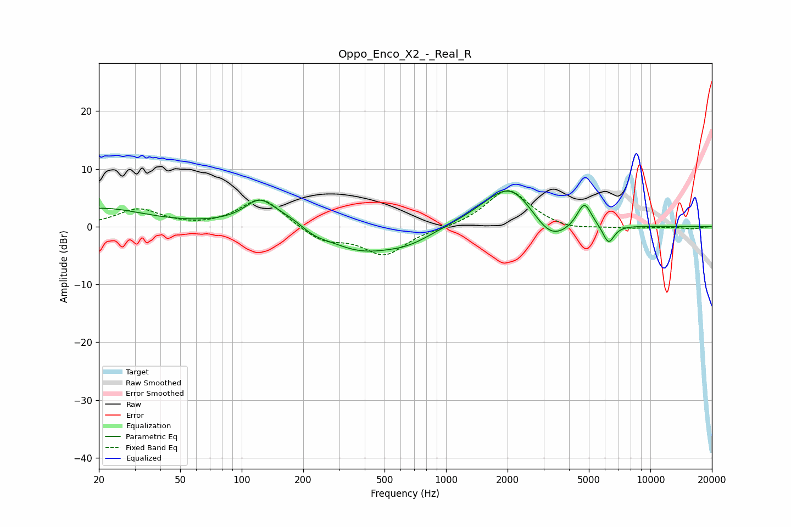

# Oppo_Enco_X2_-_Real_R
See [usage instructions](https://github.com/jaakkopasanen/AutoEq#usage) for more options and info.

### Parametric EQs
Apply preamp of -6.3 dB when using parametric equalizer.

|   # | Type    |   Fc (Hz) |    Q |   Gain (dB) |
|-----|---------|-----------|------|-------------|
|   1 | Peaking |        20 | 0.68 |         3.1 |
|   2 | Peaking |       122 | 2.01 |         3.5 |
|   3 | Peaking |       201 | 0.81 |         4.9 |
|   4 | Peaking |       222 | 1.65 |        -2.7 |
|   5 | Peaking |       357 | 0.68 |        -5.7 |
|   6 | Peaking |       662 | 1.24 |        -1.5 |
|   7 | Peaking |      2071 | 1.03 |         8.2 |
|   8 | Peaking |      3235 | 1.46 |        -4.9 |
|   9 | Peaking |      4748 | 3.93 |         4.4 |
|  10 | Peaking |      6239 | 4.91 |        -3.3 |

### Fixed Band EQs
When using fixed band (also called graphic) equalizer, apply preamp of **-6.3 dB** (if available) and set gains manually with these parameters.

|   # | Type    |   Fc (Hz) |    Q |   Gain (dB) |
|-----|---------|-----------|------|-------------|
|   1 | Peaking |        31 | 1.41 |         3   |
|   2 | Peaking |        62 | 1.41 |        -0.3 |
|   3 | Peaking |       125 | 1.41 |         5.2 |
|   4 | Peaking |       250 | 1.41 |        -2.5 |
|   5 | Peaking |       500 | 1.41 |        -4.8 |
|   6 | Peaking |      1000 | 1.41 |        -0.3 |
|   7 | Peaking |      2000 | 1.41 |         6.6 |
|   8 | Peaking |      4000 | 1.41 |        -0.8 |
|   9 | Peaking |      8000 | 1.41 |        -0.3 |
|  10 | Peaking |     16000 | 1.41 |        -0.4 |

### Graphs

