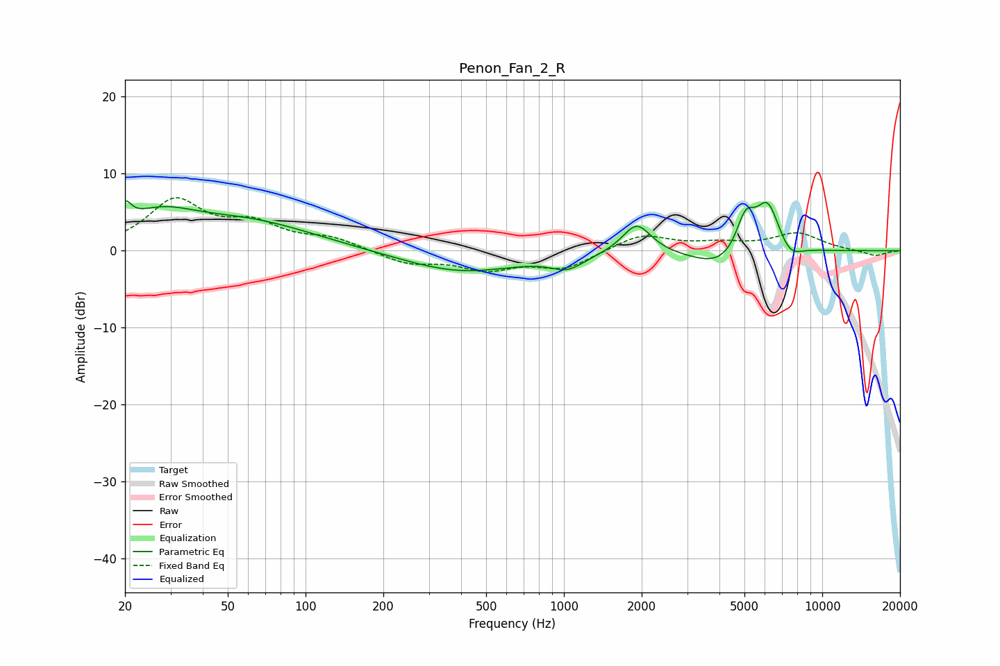

# Penon_Fan_2_R
See [usage instructions](https://github.com/jaakkopasanen/AutoEq#usage) for more options and info.

### Parametric EQs
Apply preamp of -6.6 dB when using parametric equalizer.

|   # | Type    |   Fc (Hz) |    Q |   Gain (dB) |
|-----|---------|-----------|------|-------------|
|   1 | Peaking |        20 | 6    |         2.6 |
|   2 | Peaking |        27 | 1    |         3.7 |
|   3 | Peaking |        60 | 0.54 |         3.5 |
|   4 | Peaking |       400 | 0.62 |        -2.8 |
|   5 | Peaking |      1035 | 2.17 |        -1.7 |
|   6 | Peaking |      1914 | 2.54 |         4   |
|   7 | Peaking |      4161 | 1.24 |        -2.6 |
|   8 | Peaking |      5044 | 3.68 |         4.9 |
|   9 | Peaking |      6149 | 2.82 |         6.6 |
|  10 | Peaking |      7483 | 3.01 |        -1.9 |

### Fixed Band EQs
When using fixed band (also called graphic) equalizer, apply preamp of **-7.0 dB** (if available) and set gains manually with these parameters.

|   # | Type    |   Fc (Hz) |    Q |   Gain (dB) |
|-----|---------|-----------|------|-------------|
|   1 | Peaking |        31 | 1.41 |         6.3 |
|   2 | Peaking |        62 | 1.41 |         2.9 |
|   3 | Peaking |       125 | 1.41 |         1.5 |
|   4 | Peaking |       250 | 1.41 |        -1.6 |
|   5 | Peaking |       500 | 1.41 |        -2.2 |
|   6 | Peaking |      1000 | 1.41 |        -2.2 |
|   7 | Peaking |      2000 | 1.41 |         2.1 |
|   8 | Peaking |      4000 | 1.41 |         0.8 |
|   9 | Peaking |      8000 | 1.41 |         2.2 |
|  10 | Peaking |     16000 | 1.41 |        -0.7 |

### Graphs

