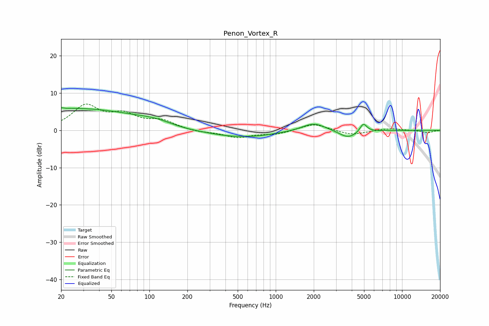

# Penon_Vortex_R
See [usage instructions](https://github.com/jaakkopasanen/AutoEq#usage) for more options and info.

### Parametric EQs
Apply preamp of -6.2 dB when using parametric equalizer.

|   # | Type    |   Fc (Hz) |    Q |   Gain (dB) |
|-----|---------|-----------|------|-------------|
|   1 | Peaking |        20 | 5.53 |        -2.9 |
|   2 | Peaking |        20 | 5.85 |         3.1 |
|   3 | Peaking |        24 | 0.23 |         5.9 |
|   4 | Peaking |       116 | 0.99 |         1.4 |
|   5 | Peaking |       153 | 0.64 |        -0.9 |
|   6 | Peaking |       549 | 0.64 |        -2   |
|   7 | Peaking |       551 | 1.91 |         0.2 |
|   8 | Peaking |      2001 | 1.54 |         2.2 |
|   9 | Peaking |      3747 | 1.93 |        -2.1 |
|  10 | Peaking |      4941 | 5.07 |         2.4 |

### Fixed Band EQs
When using fixed band (also called graphic) equalizer, apply preamp of **-7.1 dB** (if available) and set gains manually with these parameters.

|   # | Type    |   Fc (Hz) |    Q |   Gain (dB) |
|-----|---------|-----------|------|-------------|
|   1 | Peaking |        31 | 1.41 |         6.3 |
|   2 | Peaking |        62 | 1.41 |         3.6 |
|   3 | Peaking |       125 | 1.41 |         2.3 |
|   4 | Peaking |       250 | 1.41 |        -0.5 |
|   5 | Peaking |       500 | 1.41 |        -1.8 |
|   6 | Peaking |      1000 | 1.41 |        -1   |
|   7 | Peaking |      2000 | 1.41 |         1.9 |
|   8 | Peaking |      4000 | 1.41 |        -1.3 |
|   9 | Peaking |      8000 | 1.41 |         0.6 |
|  10 | Peaking |     16000 | 1.41 |        -0.6 |

### Graphs

