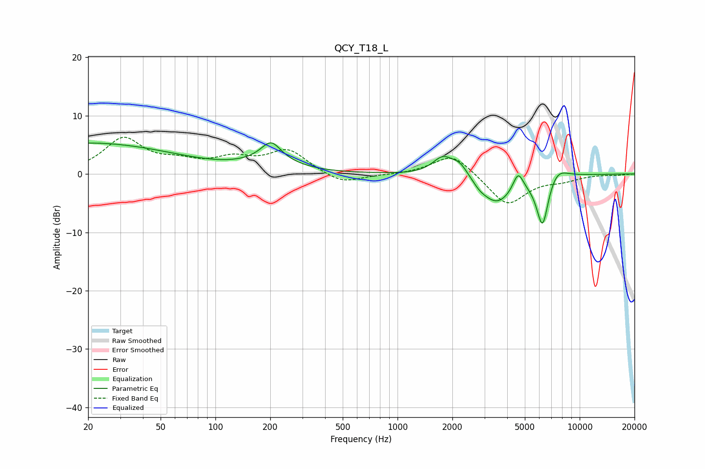

# QCY_T18_L
See [usage instructions](https://github.com/jaakkopasanen/AutoEq#usage) for more options and info.

### Parametric EQs
Apply preamp of -5.4 dB when using parametric equalizer.

|   # | Type    |   Fc (Hz) |    Q |   Gain (dB) |
|-----|---------|-----------|------|-------------|
|   1 | Peaking |        20 | 0.29 |         5.3 |
|   2 | Peaking |       203 | 1.78 |        10.6 |
|   3 | Peaking |       203 | 1.68 |        -5.8 |
|   4 | Peaking |      1775 | 2.45 |         3.1 |
|   5 | Peaking |      2207 | 3    |         2.1 |
|   6 | Peaking |      2829 | 4.52 |        -0.5 |
|   7 | Peaking |      3496 | 1.48 |        -5.1 |
|   8 | Peaking |      4593 | 4.91 |         3.3 |
|   9 | Peaking |      6253 | 4.04 |        -8.9 |
|  10 | Peaking |      7455 | 2.36 |         2.2 |

### Fixed Band EQs
When using fixed band (also called graphic) equalizer, apply preamp of **-6.4 dB** (if available) and set gains manually with these parameters.

|   # | Type    |   Fc (Hz) |    Q |   Gain (dB) |
|-----|---------|-----------|------|-------------|
|   1 | Peaking |        31 | 1.41 |         5.9 |
|   2 | Peaking |        62 | 1.41 |         1.6 |
|   3 | Peaking |       125 | 1.41 |         2.2 |
|   4 | Peaking |       250 | 1.41 |         3.9 |
|   5 | Peaking |       500 | 1.41 |        -1.9 |
|   6 | Peaking |      1000 | 1.41 |        -0.1 |
|   7 | Peaking |      2000 | 1.41 |         3.7 |
|   8 | Peaking |      4000 | 1.41 |        -5.4 |
|   9 | Peaking |      8000 | 1.41 |        -0.9 |
|  10 | Peaking |     16000 | 1.41 |        -0.2 |

### Graphs

