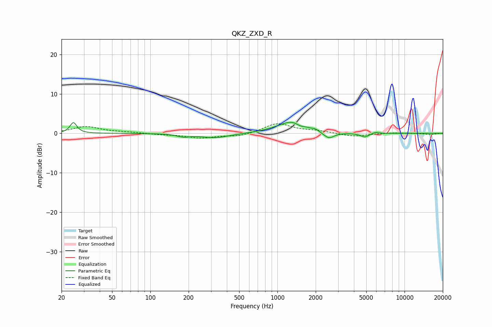

# QKZ_ZXD_R
See [usage instructions](https://github.com/jaakkopasanen/AutoEq#usage) for more options and info.

### Parametric EQs
Apply preamp of -2.9 dB when using parametric equalizer.

|   # | Type    |   Fc (Hz) |    Q |   Gain (dB) |
|-----|---------|-----------|------|-------------|
|   1 | Peaking |        25 | 5.48 |         2.7 |
|   2 | Peaking |       182 | 2.84 |        -0.7 |
|   3 | Peaking |       323 | 1.26 |        -1.2 |
|   4 | Peaking |       972 | 1.2  |         0.3 |
|   5 | Peaking |      1294 | 1.42 |         2.8 |
|   6 | Peaking |      1507 | 5.81 |        -0.4 |
|   7 | Peaking |      1986 | 5.08 |         0.5 |
|   8 | Peaking |      2536 | 3.42 |        -1.7 |
|   9 | Peaking |      4859 | 4.12 |        -1   |
|  10 | Peaking |      5902 | 5.35 |         0.4 |

### Fixed Band EQs
When using fixed band (also called graphic) equalizer, apply preamp of **-2.5 dB** (if available) and set gains manually with these parameters.

|   # | Type    |   Fc (Hz) |    Q |   Gain (dB) |
|-----|---------|-----------|------|-------------|
|   1 | Peaking |        31 | 1.41 |         1.7 |
|   2 | Peaking |        62 | 1.41 |         0.3 |
|   3 | Peaking |       125 | 1.41 |        -0.3 |
|   4 | Peaking |       250 | 1.41 |        -1.1 |
|   5 | Peaking |       500 | 1.41 |        -0.8 |
|   6 | Peaking |      1000 | 1.41 |         2.5 |
|   7 | Peaking |      2000 | 1.41 |         0.6 |
|   8 | Peaking |      4000 | 1.41 |        -0.8 |
|   9 | Peaking |      8000 | 1.41 |         0.2 |
|  10 | Peaking |     16000 | 1.41 |        -0.3 |

### Graphs

