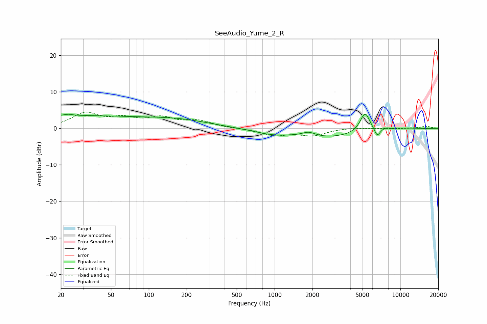

# SeeAudio_Yume_2_R
See [usage instructions](https://github.com/jaakkopasanen/AutoEq#usage) for more options and info.

### Parametric EQs
Apply preamp of -4.0 dB when using parametric equalizer.

|   # | Type    |   Fc (Hz) |    Q |   Gain (dB) |
|-----|---------|-----------|------|-------------|
|   1 | Peaking |        20 | 0.18 |         3.4 |
|   2 | Peaking |        23 | 5.81 |         3.2 |
|   3 | Peaking |        23 | 6    |        -2.9 |
|   4 | Peaking |       178 | 0.56 |         1.8 |
|   5 | Peaking |       955 | 0.95 |        -1.3 |
|   6 | Peaking |      1866 | 2.56 |         1.2 |
|   7 | Peaking |      2690 | 0.57 |        -2.4 |
|   8 | Peaking |      5233 | 3.5  |         5.4 |
|   9 | Peaking |      6547 | 6    |        -2.4 |
|  10 | Peaking |      7725 | 3.31 |         0.6 |

### Fixed Band EQs
When using fixed band (also called graphic) equalizer, apply preamp of **-4.6 dB** (if available) and set gains manually with these parameters.

|   # | Type    |   Fc (Hz) |    Q |   Gain (dB) |
|-----|---------|-----------|------|-------------|
|   1 | Peaking |        31 | 1.41 |         3.9 |
|   2 | Peaking |        62 | 1.41 |         2.2 |
|   3 | Peaking |       125 | 1.41 |         2.6 |
|   4 | Peaking |       250 | 1.41 |         1.8 |
|   5 | Peaking |       500 | 1.41 |        -0   |
|   6 | Peaking |      1000 | 1.41 |        -1.8 |
|   7 | Peaking |      2000 | 1.41 |        -1.8 |
|   8 | Peaking |      4000 | 1.41 |         0.2 |
|   9 | Peaking |      8000 | 1.41 |        -0.1 |
|  10 | Peaking |     16000 | 1.41 |         0.6 |

### Graphs

