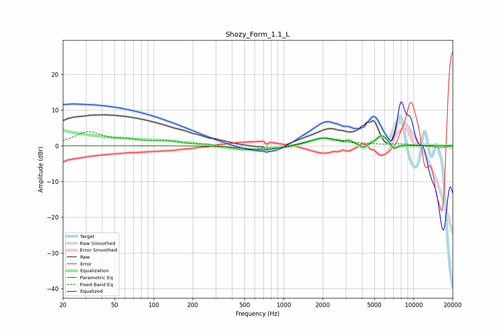

# Shozy_Form_1.1_L
See [usage instructions](https://github.com/jaakkopasanen/AutoEq#usage) for more options and info.

### Parametric EQs
Apply preamp of -2.9 dB when using parametric equalizer.

|   # | Type    |   Fc (Hz) |    Q |   Gain (dB) |
|-----|---------|-----------|------|-------------|
|   1 | Peaking |       713 | 1.08 |        -1.3 |
|   2 | Peaking |      2032 | 1.18 |         2.1 |
|   3 | Peaking |      2051 | 3.07 |         0.2 |
|   4 | Peaking |      3194 | 6    |         0.6 |
|   5 | Peaking |      4108 | 5.9  |        -1.1 |
|   6 | Peaking |      5107 | 6    |         0.3 |
|   7 | Peaking |      5670 | 4.29 |         2.5 |
|   8 | Peaking |      6292 | 6    |         0.7 |
|   9 | Peaking |      6999 | 4.46 |        -0.2 |
|  10 | Peaking |      7043 | 6    |        -1.1 |

### Fixed Band EQs
When using fixed band (also called graphic) equalizer, apply preamp of **-4.0 dB** (if available) and set gains manually with these parameters.

|   # | Type    |   Fc (Hz) |    Q |   Gain (dB) |
|-----|---------|-----------|------|-------------|
|   1 | Peaking |        31 | 1.41 |         3.7 |
|   2 | Peaking |        62 | 1.41 |         1.2 |
|   3 | Peaking |       125 | 1.41 |         1.1 |
|   4 | Peaking |       250 | 1.41 |         0.4 |
|   5 | Peaking |       500 | 1.41 |        -1.2 |
|   6 | Peaking |      1000 | 1.41 |        -0.7 |
|   7 | Peaking |      2000 | 1.41 |         2.2 |
|   8 | Peaking |      4000 | 1.41 |         0.4 |
|   9 | Peaking |      8000 | 1.41 |         0.4 |
|  10 | Peaking |     16000 | 1.41 |        -0.6 |

### Graphs

