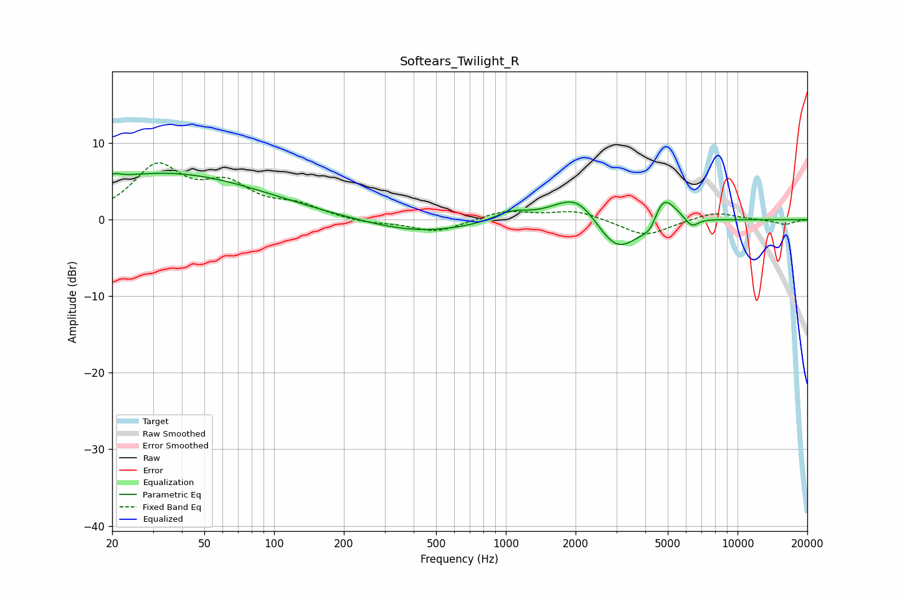

# Softears_Twilight_R
See [usage instructions](https://github.com/jaakkopasanen/AutoEq#usage) for more options and info.

### Parametric EQs
Apply preamp of -6.2 dB when using parametric equalizer.

|   # | Type    |   Fc (Hz) |    Q |   Gain (dB) |
|-----|---------|-----------|------|-------------|
|   1 | Peaking |        20 | 4.78 |         0.7 |
|   2 | Peaking |        21 | 0.71 |         0.2 |
|   3 | Peaking |        35 | 0.34 |         6   |
|   4 | Peaking |       424 | 0.61 |        -1.8 |
|   5 | Peaking |      1055 | 1.94 |         1.2 |
|   6 | Peaking |      2049 | 1.35 |         4.5 |
|   7 | Peaking |      3016 | 1.34 |        -5.7 |
|   8 | Peaking |      4290 | 3.09 |        -4.3 |
|   9 | Peaking |      4628 | 2.37 |         6.8 |
|  10 | Peaking |      6334 | 4.59 |        -1.3 |

### Fixed Band EQs
When using fixed band (also called graphic) equalizer, apply preamp of **-7.5 dB** (if available) and set gains manually with these parameters.

|   # | Type    |   Fc (Hz) |    Q |   Gain (dB) |
|-----|---------|-----------|------|-------------|
|   1 | Peaking |        31 | 1.41 |         6.6 |
|   2 | Peaking |        62 | 1.41 |         3.9 |
|   3 | Peaking |       125 | 1.41 |         1.6 |
|   4 | Peaking |       250 | 1.41 |        -0.5 |
|   5 | Peaking |       500 | 1.41 |        -1.7 |
|   6 | Peaking |      1000 | 1.41 |         1.2 |
|   7 | Peaking |      2000 | 1.41 |         1.2 |
|   8 | Peaking |      4000 | 1.41 |        -2.2 |
|   9 | Peaking |      8000 | 1.41 |         1.1 |
|  10 | Peaking |     16000 | 1.41 |        -0.6 |

### Graphs

