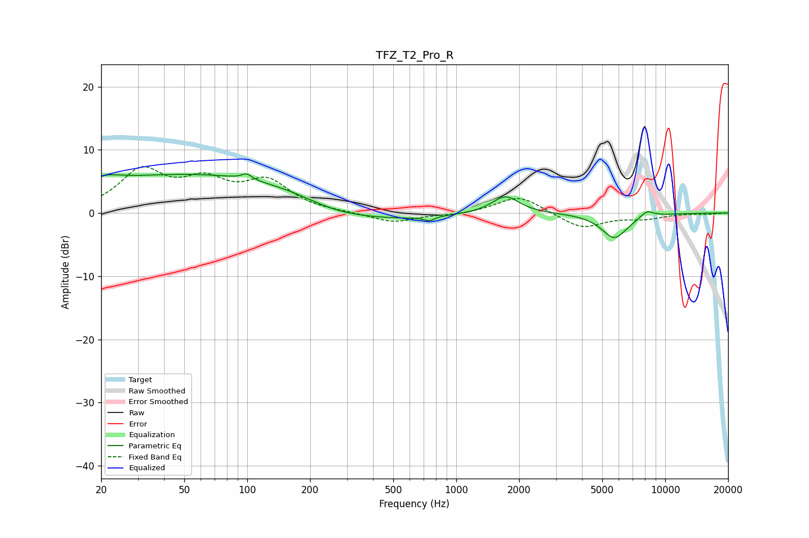

# TFZ_T2_Pro_R
See [usage instructions](https://github.com/jaakkopasanen/AutoEq#usage) for more options and info.

### Parametric EQs
Apply preamp of -6.3 dB when using parametric equalizer.

|   # | Type    |   Fc (Hz) |    Q |   Gain (dB) |
|-----|---------|-----------|------|-------------|
|   1 | Peaking |        20 | 1.72 |         1.3 |
|   2 | Peaking |        60 | 0.22 |         6.2 |
|   3 | Peaking |        99 | 6    |         0.9 |
|   4 | Peaking |       259 | 0.84 |        -1.9 |
|   5 | Peaking |       481 | 0.62 |        -1.5 |
|   6 | Peaking |       744 | 5.67 |        -0.7 |
|   7 | Peaking |      1722 | 2.17 |         2.8 |
|   8 | Peaking |      5792 | 2.22 |        -4.7 |
|   9 | Peaking |      6064 | 3.23 |         0.7 |
|  10 | Peaking |      8158 | 3.91 |         1.1 |

### Fixed Band EQs
When using fixed band (also called graphic) equalizer, apply preamp of **-7.4 dB** (if available) and set gains manually with these parameters.

|   # | Type    |   Fc (Hz) |    Q |   Gain (dB) |
|-----|---------|-----------|------|-------------|
|   1 | Peaking |        31 | 1.41 |         6.4 |
|   2 | Peaking |        62 | 1.41 |         4.3 |
|   3 | Peaking |       125 | 1.41 |         4.6 |
|   4 | Peaking |       250 | 1.41 |         0   |
|   5 | Peaking |       500 | 1.41 |        -1.5 |
|   6 | Peaking |      1000 | 1.41 |        -0.3 |
|   7 | Peaking |      2000 | 1.41 |         2.8 |
|   8 | Peaking |      4000 | 1.41 |        -2.5 |
|   9 | Peaking |      8000 | 1.41 |        -0.8 |
|  10 | Peaking |     16000 | 1.41 |        -0.2 |

### Graphs

