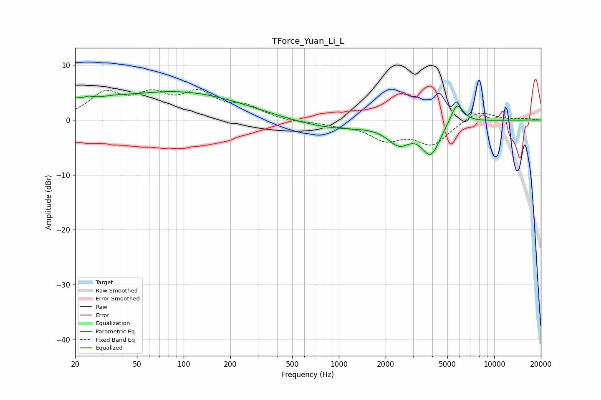

# TForce_Yuan_Li_L
See [usage instructions](https://github.com/jaakkopasanen/AutoEq#usage) for more options and info.

### Parametric EQs
Apply preamp of -5.3 dB when using parametric equalizer.

|   # | Type    |   Fc (Hz) |    Q |   Gain (dB) |
|-----|---------|-----------|------|-------------|
|   1 | Peaking |        20 | 5.97 |         1.3 |
|   2 | Peaking |        24 | 3.58 |         0.9 |
|   3 | Peaking |        42 | 0.59 |         4.4 |
|   4 | Peaking |        48 | 0.94 |        -1.6 |
|   5 | Peaking |       125 | 0.41 |         4   |
|   6 | Peaking |       909 | 0.55 |        -1.6 |
|   7 | Peaking |      2435 | 1.93 |        -3.5 |
|   8 | Peaking |      3911 | 2.68 |        -7.1 |
|   9 | Peaking |      3911 | 4.3  |         1.4 |
|  10 | Peaking |      5758 | 3.36 |         3.9 |

### Fixed Band EQs
When using fixed band (also called graphic) equalizer, apply preamp of **-5.7 dB** (if available) and set gains manually with these parameters.

|   # | Type    |   Fc (Hz) |    Q |   Gain (dB) |
|-----|---------|-----------|------|-------------|
|   1 | Peaking |        31 | 1.41 |         4.5 |
|   2 | Peaking |        62 | 1.41 |         3.8 |
|   3 | Peaking |       125 | 1.41 |         4.3 |
|   4 | Peaking |       250 | 1.41 |         2.1 |
|   5 | Peaking |       500 | 1.41 |        -0.4 |
|   6 | Peaking |      1000 | 1.41 |        -0.7 |
|   7 | Peaking |      2000 | 1.41 |        -3.2 |
|   8 | Peaking |      4000 | 1.41 |        -4.2 |
|   9 | Peaking |      8000 | 1.41 |         1.9 |
|  10 | Peaking |     16000 | 1.41 |         0.3 |

### Graphs

