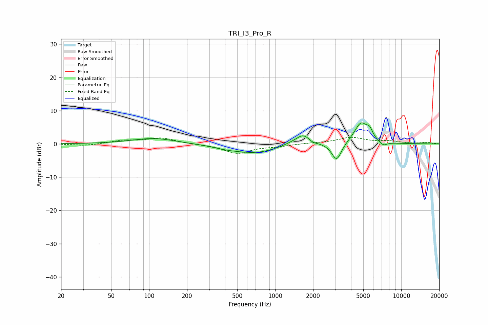

# TRI_I3_Pro_R
See [usage instructions](https://github.com/jaakkopasanen/AutoEq#usage) for more options and info.

### Parametric EQs
Apply preamp of -6.4 dB when using parametric equalizer.

|   # | Type    |   Fc (Hz) |    Q |   Gain (dB) |
|-----|---------|-----------|------|-------------|
|   1 | Peaking |       108 | 0.83 |         1.7 |
|   2 | Peaking |       414 | 1.17 |        -0.8 |
|   3 | Peaking |       712 | 0.85 |        -2.5 |
|   4 | Peaking |      1309 | 2.03 |         0.5 |
|   5 | Peaking |      1667 | 2.45 |         3.1 |
|   6 | Peaking |      1989 | 4.78 |        -0.6 |
|   7 | Peaking |      3071 | 3.63 |        -5.4 |
|   8 | Peaking |      4797 | 2.54 |         6.4 |
|   9 | Peaking |      5614 | 5.96 |         2.2 |
|  10 | Peaking |      7198 | 4.43 |        -1.3 |

### Fixed Band EQs
When using fixed band (also called graphic) equalizer, apply preamp of **-2.1 dB** (if available) and set gains manually with these parameters.

|   # | Type    |   Fc (Hz) |    Q |   Gain (dB) |
|-----|---------|-----------|------|-------------|
|   1 | Peaking |        31 | 1.41 |        -0.6 |
|   2 | Peaking |        62 | 1.41 |         1   |
|   3 | Peaking |       125 | 1.41 |         1.7 |
|   4 | Peaking |       250 | 1.41 |        -0.1 |
|   5 | Peaking |       500 | 1.41 |        -2.8 |
|   6 | Peaking |      1000 | 1.41 |        -0.6 |
|   7 | Peaking |      2000 | 1.41 |         0.2 |
|   8 | Peaking |      4000 | 1.41 |         1.9 |
|   9 | Peaking |      8000 | 1.41 |         0.7 |
|  10 | Peaking |     16000 | 1.41 |         0.4 |

### Graphs

