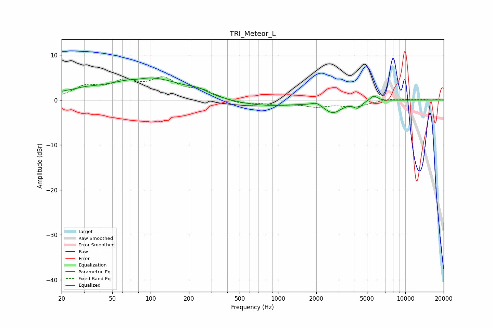

# TRI_Meteor_L
See [usage instructions](https://github.com/jaakkopasanen/AutoEq#usage) for more options and info.

### Parametric EQs
Apply preamp of -5.0 dB when using parametric equalizer.

|   # | Type    |   Fc (Hz) |    Q |   Gain (dB) |
|-----|---------|-----------|------|-------------|
|   1 | Peaking |        20 | 1.93 |         0.6 |
|   2 | Peaking |        30 | 1.36 |         1   |
|   3 | Peaking |        79 | 2.39 |        -0.4 |
|   4 | Peaking |        93 | 0.48 |         5.1 |
|   5 | Peaking |       238 | 2.15 |         0.8 |
|   6 | Peaking |       754 | 0.52 |        -1.4 |
|   7 | Peaking |      2007 | 4    |         0.7 |
|   8 | Peaking |      2694 | 2.09 |        -2.5 |
|   9 | Peaking |      4219 | 4.83 |        -1.3 |
|  10 | Peaking |      5645 | 4.72 |         1.2 |

### Fixed Band EQs
When using fixed band (also called graphic) equalizer, apply preamp of **-5.3 dB** (if available) and set gains manually with these parameters.

|   # | Type    |   Fc (Hz) |    Q |   Gain (dB) |
|-----|---------|-----------|------|-------------|
|   1 | Peaking |        31 | 1.41 |         2.7 |
|   2 | Peaking |        62 | 1.41 |         3.4 |
|   3 | Peaking |       125 | 1.41 |         4.2 |
|   4 | Peaking |       250 | 1.41 |         1.8 |
|   5 | Peaking |       500 | 1.41 |        -0.9 |
|   6 | Peaking |      1000 | 1.41 |        -0.9 |
|   7 | Peaking |      2000 | 1.41 |        -1.2 |
|   8 | Peaking |      4000 | 1.41 |        -1.4 |
|   9 | Peaking |      8000 | 1.41 |         0.4 |
|  10 | Peaking |     16000 | 1.41 |         0.2 |

### Graphs

