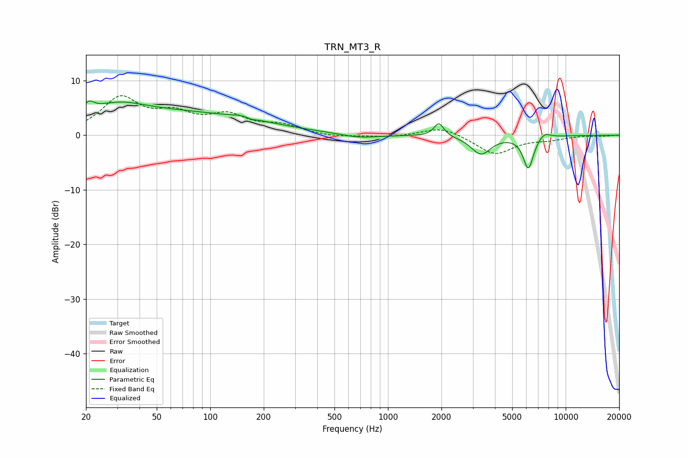

# TRN_MT3_R
See [usage instructions](https://github.com/jaakkopasanen/AutoEq#usage) for more options and info.

### Parametric EQs
Apply preamp of -6.4 dB when using parametric equalizer.

|   # | Type    |   Fc (Hz) |    Q |   Gain (dB) |
|-----|---------|-----------|------|-------------|
|   1 | Peaking |        21 | 5.24 |         1.4 |
|   2 | Peaking |        31 | 1.05 |         1.8 |
|   3 | Peaking |        46 | 0.21 |         4.4 |
|   4 | Peaking |       157 | 2.48 |         0.7 |
|   5 | Peaking |       169 | 4.37 |        -0.5 |
|   6 | Peaking |       693 | 1.36 |        -0.7 |
|   7 | Peaking |      1935 | 5.25 |         2.5 |
|   8 | Peaking |      3336 | 2.57 |        -3.4 |
|   9 | Peaking |      6162 | 4.74 |        -6   |
|  10 | Peaking |      7575 | 4.15 |         1.1 |

### Fixed Band EQs
When using fixed band (also called graphic) equalizer, apply preamp of **-7.3 dB** (if available) and set gains manually with these parameters.

|   # | Type    |   Fc (Hz) |    Q |   Gain (dB) |
|-----|---------|-----------|------|-------------|
|   1 | Peaking |        31 | 1.41 |         6.5 |
|   2 | Peaking |        62 | 1.41 |         3.2 |
|   3 | Peaking |       125 | 1.41 |         3.2 |
|   4 | Peaking |       250 | 1.41 |         1.6 |
|   5 | Peaking |       500 | 1.41 |        -0.4 |
|   6 | Peaking |      1000 | 1.41 |        -0.4 |
|   7 | Peaking |      2000 | 1.41 |         1.6 |
|   8 | Peaking |      4000 | 1.41 |        -3.5 |
|   9 | Peaking |      8000 | 1.41 |        -0.6 |
|  10 | Peaking |     16000 | 1.41 |        -0.1 |

### Graphs

