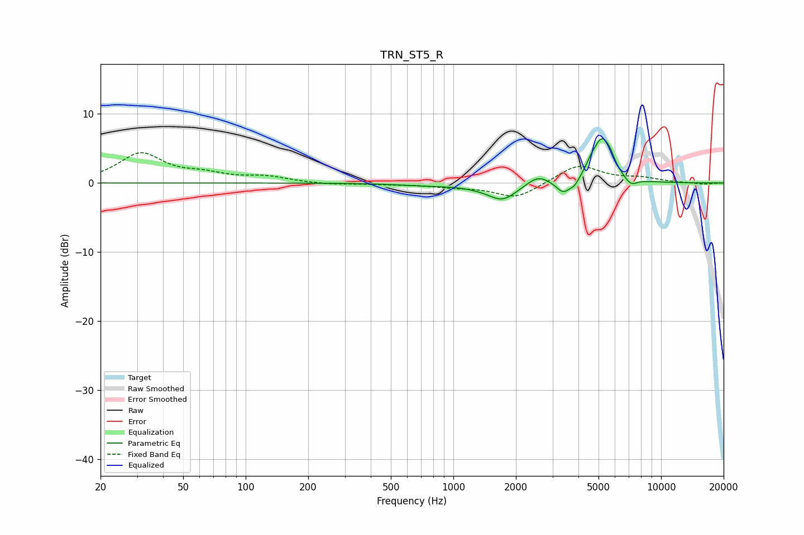

# TRN_ST5_R
See [usage instructions](https://github.com/jaakkopasanen/AutoEq#usage) for more options and info.

### Parametric EQs
Apply preamp of -6.5 dB when using parametric equalizer.

|   # | Type    |   Fc (Hz) |    Q |   Gain (dB) |
|-----|---------|-----------|------|-------------|
|   1 | Peaking |       754 | 1.04 |        -0.3 |
|   2 | Peaking |      1290 | 1.95 |        -0.2 |
|   3 | Peaking |      1724 | 2.03 |        -2.4 |
|   4 | Peaking |      2554 | 2.71 |         1.3 |
|   5 | Peaking |      3382 | 4.13 |        -1.8 |
|   6 | Peaking |      3835 | 6    |        -0.9 |
|   7 | Peaking |      4590 | 5.37 |         0.8 |
|   8 | Peaking |      5190 | 3.08 |         6.1 |
|   9 | Peaking |      5715 | 6    |         0.9 |
|  10 | Peaking |      7151 | 4.55 |        -1.1 |

### Fixed Band EQs
When using fixed band (also called graphic) equalizer, apply preamp of **-4.5 dB** (if available) and set gains manually with these parameters.

|   # | Type    |   Fc (Hz) |    Q |   Gain (dB) |
|-----|---------|-----------|------|-------------|
|   1 | Peaking |        31 | 1.41 |         4.2 |
|   2 | Peaking |        62 | 1.41 |         1   |
|   3 | Peaking |       125 | 1.41 |         0.8 |
|   4 | Peaking |       250 | 1.41 |        -0.2 |
|   5 | Peaking |       500 | 1.41 |        -0.2 |
|   6 | Peaking |      1000 | 1.41 |        -0.5 |
|   7 | Peaking |      2000 | 1.41 |        -2.2 |
|   8 | Peaking |      4000 | 1.41 |         2.7 |
|   9 | Peaking |      8000 | 1.41 |         0.6 |
|  10 | Peaking |     16000 | 1.41 |        -0.2 |

### Graphs

