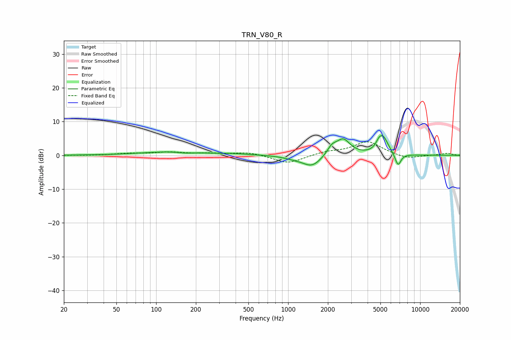

# TRN_V80_R
See [usage instructions](https://github.com/jaakkopasanen/AutoEq#usage) for more options and info.

### Parametric EQs
Apply preamp of -5.9 dB when using parametric equalizer.

|   # | Type    |   Fc (Hz) |    Q |   Gain (dB) |
|-----|---------|-----------|------|-------------|
|   1 | Peaking |       133 | 0.6  |         1.1 |
|   2 | Peaking |       167 | 2.72 |        -0.3 |
|   3 | Peaking |       400 | 1.26 |         0.3 |
|   4 | Peaking |      1088 | 2.07 |        -0.5 |
|   5 | Peaking |      1516 | 1.92 |        -3.4 |
|   6 | Peaking |      2142 | 3.91 |         2.3 |
|   7 | Peaking |      2611 | 2.63 |         4.7 |
|   8 | Peaking |      4875 | 5.98 |         1.5 |
|   9 | Peaking |      5250 | 3.52 |         4.9 |
|  10 | Peaking |      6796 | 6    |        -3.7 |

### Fixed Band EQs
When using fixed band (also called graphic) equalizer, apply preamp of **-4.1 dB** (if available) and set gains manually with these parameters.

|   # | Type    |   Fc (Hz) |    Q |   Gain (dB) |
|-----|---------|-----------|------|-------------|
|   1 | Peaking |        31 | 1.41 |        -0.1 |
|   2 | Peaking |        62 | 1.41 |         0.5 |
|   3 | Peaking |       125 | 1.41 |         0.8 |
|   4 | Peaking |       250 | 1.41 |         0.5 |
|   5 | Peaking |       500 | 1.41 |         0.9 |
|   6 | Peaking |      1000 | 1.41 |        -2.5 |
|   7 | Peaking |      2000 | 1.41 |         1   |
|   8 | Peaking |      4000 | 1.41 |         4.1 |
|   9 | Peaking |      8000 | 1.41 |        -1.1 |
|  10 | Peaking |     16000 | 1.41 |         0.6 |

### Graphs

