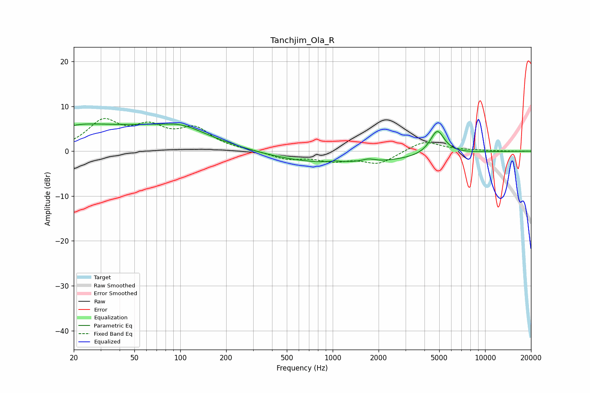

# Tanchjim_Ola_R
See [usage instructions](https://github.com/jaakkopasanen/AutoEq#usage) for more options and info.

### Parametric EQs
Apply preamp of -6.2 dB when using parametric equalizer.

|   # | Type    |   Fc (Hz) |    Q |   Gain (dB) |
|-----|---------|-----------|------|-------------|
|   1 | Peaking |        20 | 0.64 |         4   |
|   2 | Peaking |        72 | 0.4  |         4.7 |
|   3 | Peaking |        77 | 3.04 |        -0.1 |
|   4 | Peaking |       103 | 1.15 |         1.4 |
|   5 | Peaking |       308 | 5.04 |        -0   |
|   6 | Peaking |      1126 | 3.01 |         3.1 |
|   7 | Peaking |      1127 | 0.31 |        -2.9 |
|   8 | Peaking |      1133 | 3.36 |        -2.6 |
|   9 | Peaking |      1713 | 3.3  |         0.7 |
|  10 | Peaking |      4854 | 2.95 |         5.4 |

### Fixed Band EQs
When using fixed band (also called graphic) equalizer, apply preamp of **-7.4 dB** (if available) and set gains manually with these parameters.

|   # | Type    |   Fc (Hz) |    Q |   Gain (dB) |
|-----|---------|-----------|------|-------------|
|   1 | Peaking |        31 | 1.41 |         6.3 |
|   2 | Peaking |        62 | 1.41 |         4.5 |
|   3 | Peaking |       125 | 1.41 |         4.6 |
|   4 | Peaking |       250 | 1.41 |         0.2 |
|   5 | Peaking |       500 | 1.41 |        -1.7 |
|   6 | Peaking |      1000 | 1.41 |        -1.8 |
|   7 | Peaking |      2000 | 1.41 |        -2.7 |
|   8 | Peaking |      4000 | 1.41 |         2.4 |
|   9 | Peaking |      8000 | 1.41 |         0.2 |
|  10 | Peaking |     16000 | 1.41 |        -0   |

### Graphs

