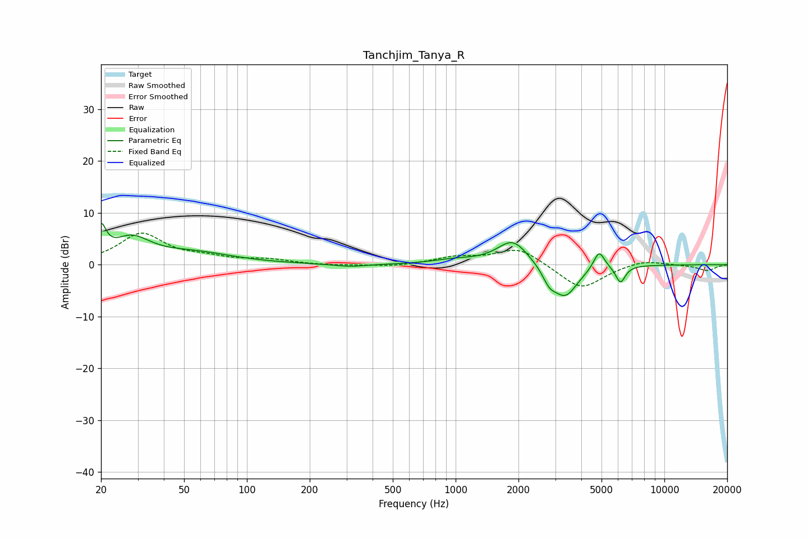

# Tanchjim_Tanya_R
See [usage instructions](https://github.com/jaakkopasanen/AutoEq#usage) for more options and info.

### Parametric EQs
Apply preamp of -8.1 dB when using parametric equalizer.

|   # | Type    |   Fc (Hz) |    Q |   Gain (dB) |
|-----|---------|-----------|------|-------------|
|   1 | Peaking |        20 | 6    |         5.4 |
|   2 | Peaking |        28 | 1.58 |         4.5 |
|   3 | Peaking |        56 | 0.74 |         2.1 |
|   4 | Peaking |       312 | 1.77 |        -0.5 |
|   5 | Peaking |       986 | 1.4  |         0.8 |
|   6 | Peaking |      1880 | 1.87 |         4.9 |
|   7 | Peaking |      2811 | 4.35 |        -2.4 |
|   8 | Peaking |      3348 | 2.3  |        -6.2 |
|   9 | Peaking |      4866 | 5.27 |         3.6 |
|  10 | Peaking |      6162 | 5.99 |        -3.3 |

### Fixed Band EQs
When using fixed band (also called graphic) equalizer, apply preamp of **-6.2 dB** (if available) and set gains manually with these parameters.

|   # | Type    |   Fc (Hz) |    Q |   Gain (dB) |
|-----|---------|-----------|------|-------------|
|   1 | Peaking |        31 | 1.41 |         5.9 |
|   2 | Peaking |        62 | 1.41 |         1   |
|   3 | Peaking |       125 | 1.41 |         0.9 |
|   4 | Peaking |       250 | 1.41 |        -0.2 |
|   5 | Peaking |       500 | 1.41 |        -0.4 |
|   6 | Peaking |      1000 | 1.41 |         1.3 |
|   7 | Peaking |      2000 | 1.41 |         3.3 |
|   8 | Peaking |      4000 | 1.41 |        -4.8 |
|   9 | Peaking |      8000 | 1.41 |         1   |
|  10 | Peaking |     16000 | 1.41 |        -1.1 |

### Graphs

