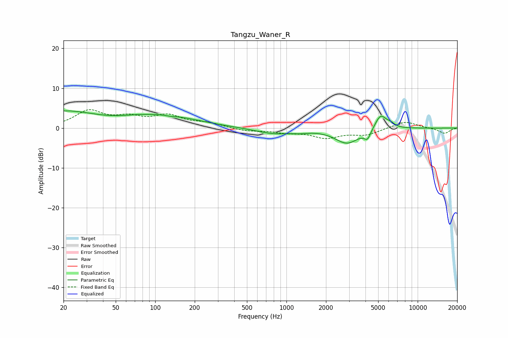

# Tangzu_Waner_R
See [usage instructions](https://github.com/jaakkopasanen/AutoEq#usage) for more options and info.

### Parametric EQs
Apply preamp of -4.4 dB when using parametric equalizer.

|   # | Type    |   Fc (Hz) |    Q |   Gain (dB) |
|-----|---------|-----------|------|-------------|
|   1 | Peaking |        20 | 0.57 |         4   |
|   2 | Peaking |        74 | 1.12 |         0.6 |
|   3 | Peaking |       123 | 0.58 |         2.7 |
|   4 | Peaking |       132 | 3.52 |        -0.2 |
|   5 | Peaking |       798 | 1.01 |        -1.4 |
|   6 | Peaking |      1275 | 2.44 |        -0.4 |
|   7 | Peaking |      2900 | 1.53 |        -3.8 |
|   8 | Peaking |      4145 | 5.71 |        -2.2 |
|   9 | Peaking |      5219 | 3.23 |         3.7 |
|  10 | Peaking |      6214 | 4.38 |         0.8 |

### Fixed Band EQs
When using fixed band (also called graphic) equalizer, apply preamp of **-4.7 dB** (if available) and set gains manually with these parameters.

|   # | Type    |   Fc (Hz) |    Q |   Gain (dB) |
|-----|---------|-----------|------|-------------|
|   1 | Peaking |        31 | 1.41 |         4.1 |
|   2 | Peaking |        62 | 1.41 |         2.2 |
|   3 | Peaking |       125 | 1.41 |         2.8 |
|   4 | Peaking |       250 | 1.41 |         1.1 |
|   5 | Peaking |       500 | 1.41 |        -0.7 |
|   6 | Peaking |      1000 | 1.41 |        -0.9 |
|   7 | Peaking |      2000 | 1.41 |        -2.3 |
|   8 | Peaking |      4000 | 1.41 |        -1.6 |
|   9 | Peaking |      8000 | 1.41 |         1.8 |
|  10 | Peaking |     16000 | 1.41 |        -1.4 |

### Graphs

