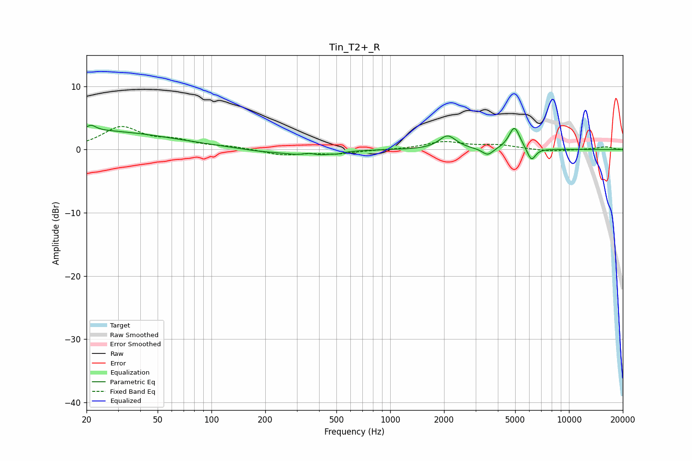

# Tin_T2+_R
See [usage instructions](https://github.com/jaakkopasanen/AutoEq#usage) for more options and info.

### Parametric EQs
Apply preamp of -3.9 dB when using parametric equalizer.

|   # | Type    |   Fc (Hz) |    Q |   Gain (dB) |
|-----|---------|-----------|------|-------------|
|   1 | Peaking |        20 | 0.3  |         3   |
|   2 | Peaking |        21 | 5.52 |         0.8 |
|   3 | Peaking |       191 | 1.09 |        -0.4 |
|   4 | Peaking |       351 | 3.33 |         0.8 |
|   5 | Peaking |       357 | 1.55 |        -1.4 |
|   6 | Peaking |       509 | 6    |        -0.2 |
|   7 | Peaking |      2094 | 2.98 |         2.2 |
|   8 | Peaking |      3511 | 4.56 |        -1.2 |
|   9 | Peaking |      4953 | 4.5  |         3.6 |
|  10 | Peaking |      6160 | 5.89 |        -2.1 |

### Fixed Band EQs
When using fixed band (also called graphic) equalizer, apply preamp of **-3.7 dB** (if available) and set gains manually with these parameters.

|   # | Type    |   Fc (Hz) |    Q |   Gain (dB) |
|-----|---------|-----------|------|-------------|
|   1 | Peaking |        31 | 1.41 |         3.4 |
|   2 | Peaking |        62 | 1.41 |         1.2 |
|   3 | Peaking |       125 | 1.41 |         0.4 |
|   4 | Peaking |       250 | 1.41 |        -0.9 |
|   5 | Peaking |       500 | 1.41 |        -0.6 |
|   6 | Peaking |      1000 | 1.41 |        -0   |
|   7 | Peaking |      2000 | 1.41 |         1.2 |
|   8 | Peaking |      4000 | 1.41 |         0.6 |
|   9 | Peaking |      8000 | 1.41 |        -0.3 |
|  10 | Peaking |     16000 | 1.41 |         0.4 |

### Graphs

