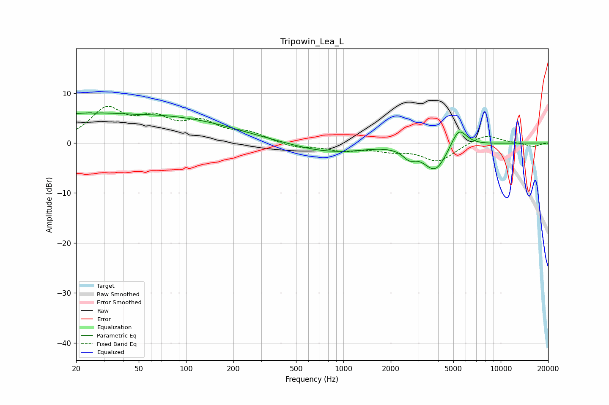

# Tripowin_Lea_L
See [usage instructions](https://github.com/jaakkopasanen/AutoEq#usage) for more options and info.

### Parametric EQs
Apply preamp of -6.2 dB when using parametric equalizer.

|   # | Type    |   Fc (Hz) |    Q |   Gain (dB) |
|-----|---------|-----------|------|-------------|
|   1 | Peaking |        23 | 0.18 |         5.8 |
|   2 | Peaking |        26 | 5.57 |         3.4 |
|   3 | Peaking |        26 | 5.9  |        -3.4 |
|   4 | Peaking |        48 | 2.7  |        -0.1 |
|   5 | Peaking |       145 | 0.49 |         1.7 |
|   6 | Peaking |       716 | 0.73 |        -1.5 |
|   7 | Peaking |      1108 | 1.09 |        -0.6 |
|   8 | Peaking |      2619 | 3.59 |        -1.8 |
|   9 | Peaking |      3836 | 1.85 |        -5.6 |
|  10 | Peaking |      5400 | 2.72 |         4.1 |

### Fixed Band EQs
When using fixed band (also called graphic) equalizer, apply preamp of **-7.4 dB** (if available) and set gains manually with these parameters.

|   # | Type    |   Fc (Hz) |    Q |   Gain (dB) |
|-----|---------|-----------|------|-------------|
|   1 | Peaking |        31 | 1.41 |         6.4 |
|   2 | Peaking |        62 | 1.41 |         4.1 |
|   3 | Peaking |       125 | 1.41 |         3.6 |
|   4 | Peaking |       250 | 1.41 |         1.8 |
|   5 | Peaking |       500 | 1.41 |        -0.9 |
|   6 | Peaking |      1000 | 1.41 |        -1.3 |
|   7 | Peaking |      2000 | 1.41 |        -1.2 |
|   8 | Peaking |      4000 | 1.41 |        -3.6 |
|   9 | Peaking |      8000 | 1.41 |         1.9 |
|  10 | Peaking |     16000 | 1.41 |        -0.7 |

### Graphs

