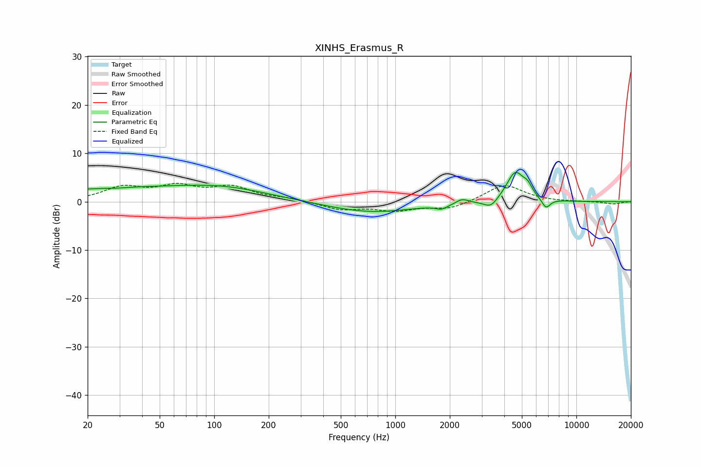

# XINHS_Erasmus_R
See [usage instructions](https://github.com/jaakkopasanen/AutoEq#usage) for more options and info.

### Parametric EQs
Apply preamp of -6.2 dB when using parametric equalizer.

|   # | Type    |   Fc (Hz) |    Q |   Gain (dB) |
|-----|---------|-----------|------|-------------|
|   1 | Peaking |        29 | 3.03 |        -0.1 |
|   2 | Peaking |        40 | 0.21 |         2.8 |
|   3 | Peaking |       113 | 0.63 |         1.1 |
|   4 | Peaking |       733 | 0.58 |        -2.2 |
|   5 | Peaking |      1802 | 4.27 |        -0.9 |
|   6 | Peaking |      2338 | 4.39 |         1   |
|   7 | Peaking |      3368 | 3.62 |        -1.8 |
|   8 | Peaking |      4604 | 2.8  |         6.2 |
|   9 | Peaking |      5387 | 5.64 |         1.6 |
|  10 | Peaking |      6794 | 5.85 |        -2   |

### Fixed Band EQs
When using fixed band (also called graphic) equalizer, apply preamp of **-3.9 dB** (if available) and set gains manually with these parameters.

|   # | Type    |   Fc (Hz) |    Q |   Gain (dB) |
|-----|---------|-----------|------|-------------|
|   1 | Peaking |        31 | 1.41 |         2.8 |
|   2 | Peaking |        62 | 1.41 |         2.8 |
|   3 | Peaking |       125 | 1.41 |         2.8 |
|   4 | Peaking |       250 | 1.41 |         0.6 |
|   5 | Peaking |       500 | 1.41 |        -1.6 |
|   6 | Peaking |      1000 | 1.41 |        -1.6 |
|   7 | Peaking |      2000 | 1.41 |        -1.5 |
|   8 | Peaking |      4000 | 1.41 |         3.6 |
|   9 | Peaking |      8000 | 1.41 |        -0   |
|  10 | Peaking |     16000 | 1.41 |        -0.5 |

### Graphs

